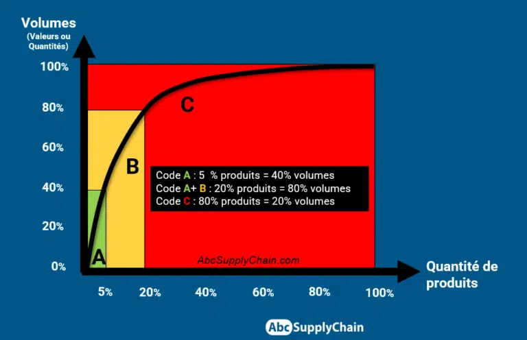
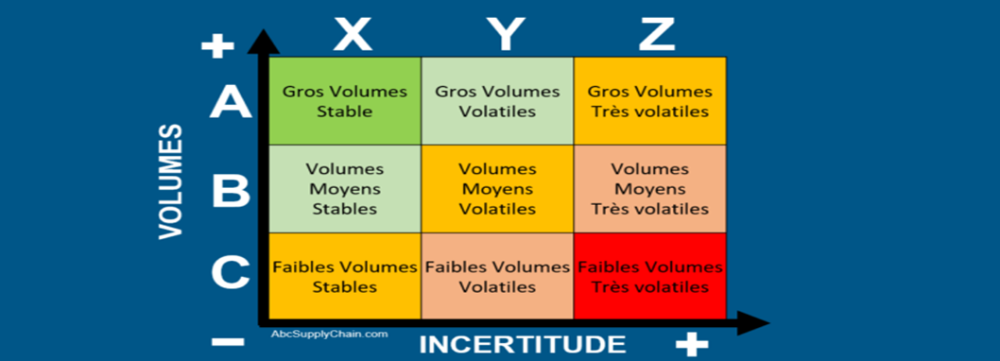
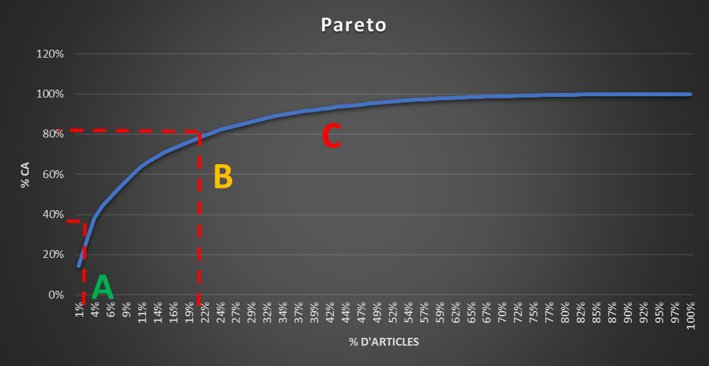

# Amélioration du choix de la politique de réapprovisionnement du stock de produits finis

## Présentation du projet

### Le contexte du projet

Dans un environnement économique caractérisé par une forte volatilité de la demande, une diversification des produits et des exigences croissantes des clients en matière de disponibilité, les entreprises doivent accorder une attention particulière à la coordination entre la planification industrielle et commerciale et la gestion des stocks. Une mauvaise adéquation entre la demande prévisionnelle, les capacités disponibles et les niveaux de stock peut en effet entraîner des conséquences importantes, telles que des ruptures de stock, des surstocks, une augmentation des coûts de stockage ou encore une dégradation du niveau de service client.

Dans ce contexte, l’alignement du **Plan Industriel et Commercial (PIC)** avec la **gestion des stocks** constitue un enjeu majeur de la performance de la chaîne d’approvisionnement. Le PIC permet d’établir une vision globale et à moyen terme des besoins de l’entreprise en confrontant les prévisions de la demande aux capacités de production, d’approvisionnement et de stockage. La gestion des stocks, quant à elle, vise à garantir la disponibilité des produits au moment où ils sont nécessaires, tout en limitant les coûts liés à leur détention.

#### Le Plan Industriel et Commercial (PIC)

Le **Plan Industriel et Commercial (PIC)** est un processus de planification à moyen terme permettant de coordonner les besoins commerciaux avec les ressources industrielles et logistiques disponibles. Il constitue un outil d’aide à la décision qui permet à l’entreprise d’anticiper les évolutions de la demande et d’adapter, en conséquence, ses niveaux de production, d’approvisionnement et de stocks.

Le PIC s’appuie notamment sur plusieurs éléments : les historiques de ventes, les prévisions commerciales, les tendances du marché, les objectifs de l’entreprise, les capacités de production, les délais d’approvisionnement ainsi que les niveaux de stocks disponibles. Son objectif est de parvenir à un équilibre entre la demande prévisionnelle et les ressources de l’entreprise, tout en prenant en compte les contraintes opérationnelles et financières.

Ainsi, un PIC correctement construit doit permettre d’anticiper les besoins futurs et de définir les volumes à produire ou à approvisionner sur une période donnée. Il contribue également à réduire les décisions prises dans l’urgence et à améliorer la coordination entre les différents services, notamment les fonctions commerciales, industrielles, achats et logistiques

#### La prévision de la demande

La **prévision de la demande** constitue l’un des principaux éléments du processus PIC. Elle consiste à estimer les quantités de produits qui seront demandées par les clients sur une période future, à partir notamment des historiques de ventes et de différents facteurs pouvant influencer la demande.

La qualité des prévisions joue un rôle déterminant dans la performance de la chaîne d’approvisionnement. Une **sous-estimation de la demande** peut conduire à des ruptures de stock, à une baisse du taux de service et à des ventes perdues. À l’inverse, une **surestimation** peut générer des stocks excessifs, augmenter les coûts de stockage et immobiliser inutilement des ressources financières.

Il est donc essentiel d’améliorer la fiabilité des prévisions et d’identifier les produits pour lesquels la demande est stable, variable ou difficilement prévisible. Cette analyse permet ensuite d’adapter les politiques de stock et les décisions de planification en fonction du comportement réel de chaque famille de produits.

#### La gestion des stocks

La **gestion des stocks** regroupe l’ensemble des méthodes et des actions permettant de planifier, suivre et contrôler les quantités de produits disponibles au sein de l’entreprise. Son principal objectif est de trouver un équilibre entre deux exigences parfois contradictoires : **garantir la disponibilité des produits pour satisfaire la demande des clients et minimiser les coûts liés au stockage**.

Un niveau de stock insuffisant peut entraîner des ruptures, des retards de livraison et une détérioration de la satisfaction client. À l’inverse, un niveau de stock trop élevé entraîne des coûts supplémentaires liés au stockage, à la manutention, à l’espace occupé et à l’immobilisation financière. Certains produits peuvent également présenter un risque d’obsolescence ou de dépréciation lorsqu’ils restent trop longtemps en stock.

La gestion des stocks doit donc être adaptée aux caractéristiques propres à chaque produit : niveau de consommation, fréquence de demande, valeur, taux de rotation, variabilité des ventes, délai d’approvisionnement et criticité pour l’activité.

#### L’analyse ABC

Afin d’améliorer l’efficacité de la gestion des stocks, l’**analyse ABC** constitue un outil particulièrement pertinent. Elle permet de classer les articles selon leur importance économique, généralement à partir de leur valeur de consommation annuelle.

La méthode ABC repose sur la loi de Pareto (ou loi 80-20), qui indique que 20 % des efforts sont à l'origine de 80 % des résultats. Si nous appliquons cette logique à l'écosystème de l'entrepôt, 20 % des articles représentent 80 % des mouvements de marchandises, alors que les 80 % restants génèrent 20 % de mouvements

Les articles sont généralement répartis en trois catégories :

- **Classe A** : articles représentant une part importante de la valeur totale des consommations, bien qu’ils soient relativement peu nombreux. Ils nécessitent un suivi rigoureux et une attention particulière en matière de prévision et de gestion des stocks ;

- **Classe B** : articles présentant une importance intermédiaire et nécessitant un niveau de contrôle adapté ;

- **Classe C** : articles représentant une faible part de la valeur totale des consommations, mais pouvant être nombreux. Leur gestion peut être simplifiée afin de concentrer les ressources sur les articles les plus stratégiques.

L’analyse ABC permet ainsi de hiérarchiser les efforts de gestion et d’affecter les ressources de manière plus efficace. Toutefois, la seule valeur de consommation ne permet pas de prendre en compte la variabilité de la demande. Il est donc pertinent de compléter cette analyse par une seconde dimension.

#### L’analyse XYZ et la méthode ABC-XYZ

L’**analyse XYZ** vient compléter l’analyse ABC en classant les produits selon la **régularité et la variabilité de leur demande**. Elle permet notamment de distinguer les produits dont les ventes sont relativement prévisibles de ceux dont la demande est plus incertaine.

Les articles peuvent ainsi être répartis en trois catégories :

- **Classe X** : demande relativement stable et prévisible ;

- **Classe Y** : demande présentant des variations modérées ou une certaine saisonnalité ;

- **Classe Z** : demande fortement variable et difficilement prévisible.

La combinaison des deux analyses donne naissance à la **méthode ABC-XYZ**, qui permet d’obtenir une vision plus complète de la criticité des articles. Alors que la classification ABC renseigne principalement sur l’importance économique des produits, la classification XYZ apporte une information complémentaire sur leur niveau de prévisibilité.

Cette approche permet donc d’adapter les politiques de gestion selon le profil de chaque produit. Par exemple, un article **AX**, à forte valeur et à demande stable, pourra faire l’objet d’un suivi très précis avec une politique de réapprovisionnement optimisée. À l’inverse, un article **AZ**, présentant une forte valeur et une demande très variable, nécessitera une attention particulière concernant les prévisions, les stocks de sécurité et les risques de rupture ou de surstockage.

La méthode ABC-XYZ constitue ainsi un outil d’aide à la décision permettant de mieux différencier les politiques de stock et d’améliorer l’allocation des ressources de la supply chain.

#### L’articulation entre le PIC et la gestion des stocks

L’enjeu principal du projet consiste donc à créer une meilleure cohérence entre les décisions prises dans le cadre du PIC et les politiques de gestion des stocks. En effet, les niveaux de stock ne doivent pas être déterminés indépendamment des prévisions de ventes et des capacités disponibles. Ils doivent être construits en fonction du comportement de la demande et du niveau de criticité des produits.

L’utilisation de la méthode ABC-XYZ permet dans ce sens d’apporter une segmentation plus fine du portefeuille de produits. Elle permet d’identifier les références nécessitant une surveillance renforcée, d’adapter les niveaux de stock de sécurité et de mieux orienter les efforts de prévision.

Cette démarche doit contribuer à atteindre plusieurs objectifs :

- Améliorer la disponibilité des produits et le taux de service ;

- Réduire les risques de rupture de stock ;

- Limiter les situations de surstockage ;

- Optimiser les niveaux de stock de sécurité ;

- Améliorer la fiabilité des prévisions ;

- Réduire les coûts liés à la détention des stocks ;

- Faciliter la prise de décision dans le cadre du PIC ;

- Améliorer la coordination entre les fonctions commerciales, industrielles et logistiques.

Ainsi, l’objectif n’est pas simplement de réduire les stocks, mais de **déterminer le niveau de stock le plus pertinent pour chaque catégorie de produits**, en tenant compte simultanément de son importance économique et de la prévisibilité de sa demande.

Dans cette perspective, la problématique retenue pour cette étude est la suivante :

**Quel est le rôle de la méthode ABC-XYZ dans l’alignement du Plan Industriel et Commercial (PIC) avec la gestion des stocks, afin d’ajuster et d’optimiser les niveaux de stock tout en garantissant un niveau de service adapté à la demande ?**

Cette problématique permettra d’étudier dans quelle mesure la segmentation des produits selon leur valeur et la variabilité de leur demande peut contribuer à améliorer les décisions de planification et de gestion des stocks.

### Périmètre de la problématique

Afin de rendre l’étude pertinente et exploitable, il est nécessaire de définir précisément son périmètre. L’entreprise dispose d’un portefeuille composé de différentes catégories de produits finis, présentant des caractéristiques de demande, de consommation et de rotation différentes. Une analyse globale de l’ensemble des références pourrait rendre les résultats difficiles à interpréter et limiter la pertinence des recommandations.

Le périmètre de cette étude sera donc défini selon **la catégorie de produits, les types de clients et la période d’observation**.

L’analyse portera plus précisément sur les ventes de la catégorie **Boissons (BEV)** destinées aux différents clients des circuits **HD (Hors Domicile)** et **GMS (Grandes et Moyennes Surfaces)** au cours de l’**année 2022**.

Le choix de cette catégorie et de cette période permettra d’analyser les comportements de consommation observés sur une année complète et de disposer d’un historique suffisamment représentatif pour étudier à la fois le niveau de consommation et sa variabilité.

L’étude s’appuiera notamment sur les données historiques de ventes afin de :

1.  Mesurer le poids économique des différentes références

2.  Réaliser une classification **ABC** selon leur importance

3.  Réaliser une classification **XYZ** selon la régularité de leur demande

4.  Croiser les deux classifications afin d'obtenir une segmentation **ABC-XYZ**

5.  Identifier les catégories de produits nécessitant une politique de stock spécifique

6.  Analyser l’adéquation entre les niveaux de stock et les besoins issus du PIC

7.  Formuler des recommandations visant à optimiser les stocks tout en maintenant un niveau de service satisfaisant.

Le périmètre ainsi défini permettra de concentrer l’analyse sur les produits et marchés retenus, tout en fournissant une méthodologie pouvant, à terme, être étendue à d’autres catégories de produits ou à d’autres périodes.

### Objectifs du projet

L’objectif principal de ce projet est **d’analyser et d’optimiser l’adéquation entre le Plan Industriel et Commercial (PIC) et la gestion des stocks à travers l’utilisation de la méthode ABC-XYZ**, afin d’améliorer la disponibilité des produits, de réduire les risques de rupture et de surstockage et de définir des niveaux de stock adaptés au comportement de la demande.

Cette démarche vise ainsi à améliorer la performance de la chaîne d’approvisionnement en permettant une gestion différenciée des références selon leur importance économique et la prévisibilité de leur demande.

Pour atteindre cet objectif général, plusieurs objectifs spécifiques peuvent être définis :

**Analyser les données historiques de ventes**

Étudier les ventes de la catégorie **Boissons (BEV)** destinées aux clients **HD et GMS** sur l’année 2022 afin d’identifier les principaux comportements de consommation et les tendances de la demande.

**Identifier les références les plus importantes**

Classer les références selon leur poids économique à travers une **analyse ABC**, afin d’identifier les produits représentant la part la plus importante de la consommation et nécessitant un suivi prioritaire.

**Mesurer la variabilité de la demande**

Analyser la régularité et la variabilité des ventes afin de déterminer le niveau de prévisibilité de chaque référence et de réaliser une classification **XYZ**.

**Construire une segmentation ABC-XYZ**

Croiser les résultats des analyses ABC et XYZ afin d'obtenir une segmentation des références selon deux dimensions complémentaires : **leur importance économique et la prévisibilité de leur demande**.

**Identifier les risques de rupture et de surstockage**

Mettre en évidence les références présentant un risque élevé de rupture ou, à l’inverse, un niveau de stock excessif, afin de mieux cibler les actions d’amélioration.

**Proposer une politique de gestion des stocks différenciée**

Définir des règles de gestion adaptées aux différentes catégories issues de la matrice ABC-XYZ, notamment en matière de fréquence de suivi, de niveau de stock de sécurité, de fréquence de réapprovisionnement et de niveau de vigilance

## Traitement de la problématique

Cette partie présente la démarche suivie pour traiter la problématique ainsi que les principaux résultats obtenus. L’objectif est d’identifier les références présentant les plus forts enjeux en matière de rotation et de variabilité de la demande, afin d’adapter les niveaux de stock et d’améliorer la disponibilité des produits.

Le portefeuille de ventes de l’entreprise comprend un nombre important de références, réparties selon différentes catégories de produits et différents canaux de distribution. Afin de déterminer les références les plus importantes en termes de valeur et de mieux orienter les actions de gestion des stocks, une classification des articles a été réalisée selon deux approches complémentaires : **la méthode ABC**, puis **la méthode ABC-XYZ**.

### Analyse ABC

#### Constitution et exploitation de la base de données

Dans un premier temps, la base de données relative aux ventes et aux prévisions de ventes de l’année 2022 a été collectée. Cette base regroupe, pour chaque référence, les informations relatives au canal de distribution, au code article, au libellé ainsi qu’aux ventes et prévisions mensuelles.

Le tableau ci-dessous présente un extrait de cette base de données.

**Tableau 1 : Extrait de la base de données KPI**

| Destination | Code_article | Libellé                        | Somme de M1     | Somme de M2      | Somme de M3     | Somme de M4     | Somme de M5     |
|-------------|--------------|--------------------------------|-----------------|------------------|-----------------|-----------------|-----------------|
| GMS         | 340019705    | KAS CITRON PET 1.5L (84X6)     | 36 510 536,16 € | 16 835 413,90 €  | 18 999 001,22 € | 15 550 783,92 € | 15 753 620,23 € |
| GMS         | 340019735    | MIRINDA ORANGE PET 2L (64X6)   | 40 524 334,08 € | 74 592 248,83 €  | 25 344 880,13 € | 24 039 859,20 € | 23 284 320,77 € |
| GMS         | 340019736    | MIRINDA FRAISE PET 2L (64X6)   | 77 545 717,25 € | 154 541 952,00 € | 63 259 172,35 € | 60 443 074,56 € | 37 227 439,10 € |
| GMS         | 340019738    | MIRINDA TROPICAL PET 2L (64X6) | 3 090 839,04 €  | 39 631 425,02 €  | 1 236 335,62 €  | 1 373 706,24 €  | 0 €             |
| GMS         | 340019741    | MIRINDA ANANAS PET 2L (64X6)   | 8 036 181,50 €  | 47 667 606,53 €  | 4 739 286,53 €  | 8 929 090,56 €  | 6 799 845,89 €  |
| GMS         | 340019792    | PEPSI REG PET 1L (125X6)       | 14 622 459,00 € | 20 592 178,50 €  | 9 725 947,50 €  | 12 073 590,00 € | 15 762 742,50 € |
| GMS         | 340019854    | 7UP ZERO CAN 330MLX6 (99X4)    | 35 060 811,02 € | 13 322 088,64 €  | 12 971 954,53 € | 17 880 539,62 € | 20 124 528,11 € |

Le périmètre de l’analyse concerne les références de la catégorie des boissons destinées aux canaux **GMS et HD**, à l’exception de la gamme **LIPTON**. Cette exclusion s’explique par un changement de code article intervenu au cours de l’année, qui aurait pu fausser les résultats de la classification.

La valeur exprimée en euros pour chaque référence correspond aux ventes réalisées ainsi qu’aux prévisions de ventes pour les périodes considérées.

À partir de cette base, un **tableau croisé dynamique** a été élaboré afin de regrouper les références selon leur code article et leur libellé, puis de calculer la valeur totale des ventes et prévisions associées à chaque référence.

La classification ABC a ensuite été réalisée à partir de deux indicateurs :

- Le **pourcentage cumulé du nombre de références**.

- Le **pourcentage cumulé du chiffre d’affaires**.

Cette méthode permet de répartir les articles en trois catégories :

- **Classe A** : références représentant une part importante du chiffre d’affaires ;

- **Classe B** : références ayant une contribution intermédiaire ;

- **Classe C** : références représentant une faible contribution individuelle au chiffre d’affaires.

La classification a été appliquée aux deux canaux de distribution étudiés, **GMS et HD**, afin d’identifier les références ayant le plus fort impact sur la valeur globale des ventes.

| ID  | Code_artcl    | Libellé                                   | Somme de FY         | % Article | % CA | ABC   |
|-----|---------------|-------------------------------------------|---------------------|-----------|------|-------|
| 1   | **340029920** | PEPSI ZERO PET 1.5LX4 FF (2X45)           | 10 190 808 439,54 € | 1%        | 15%  | **A** |
| 2   | **340029918** | PEPSI ZERO PET 1.5L (84X6)                | 8 503 061 863,26 €  | 3%        | 27%  | **A** |
| 3   | **340036289** | PEPSI ZERO PET 1.5L (DP40X6)              | 8 140 676 636,77 €  | 4%        | 38%  | **A** |
| 4   | **340034684** | PEPSI ZERO CAN 330MLX6 (99X4)             | 4 033 112 533,81 €  | 5%        | 44%  | **B** |
| 5   | **340034534** | PEPSI ZERO PET 1.5LX5+1 MF (X84)          | 3 100 704 951,71 €  | 6%        | 48%  | **B** |
| 6   | **340029697** | PEPSI ZERO PET 1.5LX4 FF (X120)           | 2 852 420 963,93 €  | 8%        | 52%  | **B** |
| 7   | **340054039** | PEPSI REG PET 1.5L (84X6)                 | 2 825 171 765,64 €  | 9%        | 56%  | **B** |
| 8   | **340027829** | PEPSI REG PET 1.5L (84X6)                 | 2 825 171 765,64 €  | 10%       | 60%  | **B** |
| 9   | **340029269** | 7UP REG PET 1.5L (84X6)                   | 2 406 588 896,57 €  | 11%       | 64%  | **B** |
| 10  | **340019873** | 7UP MOJITO PET 1.5L (84X6)                | 1 849 716 916,32 €  | 13%       | 67%  | **B** |
| 11  | **340019860** | 7UP ZERO PET 1.5L (84X6)                  | 1 779 846 603,82 €  | 14%       | 69%  | **B** |
| 12  | **340026916** | PEPSI ZERO PET 2L MF (64X6)               | 1 380 514 850,42 €  | 15%       | 71%  | **B** |
| 13  | **340019736** | MIRINDA FRAISE PET 2L (64X6)              | 1 247 170 545,10 €  | 16%       | 73%  | **B** |
| 14  | **340039544** | PEPSI ZERO PET 1.5LX(5+1)(DP40)           | 1 223 780 871,08 €  | 18%       | 75%  | **B** |
| 15  | **340029273** | 7UP REG CAN 330MLX6 (99X4)                | 1 124 533 278,26 €  | 19%       | 76%  | **B** |
| 16  | **340027831** | PEPSI REG PET 1.5LX4 FF (2X45)            | 1 069 720 074,00 €  | 20%       | 78%  | **B** |
| 17  | **340054041** | PEPSI REG PET 1.5LX4 FF (2X45)            | 1 069 720 074,00 €  | 22%       | 79%  | **B** |
| 18  | **340054042** | PEPSI REG PET 1.5LX5+1 MF (X84)           | 1 046 634 475,58 €  | 23%       | 81%  | **C** |
| 19  | **340034513** | PEPSI REG PET 1.5LX5+1 MF (X84)           | 1 046 634 475,58 €  | 24%       | 82%  | **C** |
| 20  | **340034536** | 7UP REG PET 1.5LX5+1 MF (X84)             | 760 309 735,90 €    | 25%       | 83%  | **C** |
| 21  | **340030045** | PEPSI ZERO PET 1.5L (2X180)               | 745 906 390,20 €    | 27%       | 84%  | **C** |
| 22  | **340047085** | ROCKSTAR GUAVA PUNCHED 500ML (144X12) FR  | 705 804 184,60 €    | 28%       | 85%  | **C** |
| 23  | **340047084** | ROCKSTAR ORIGINAL 500ML (144X12) FR       | 677 927 606,80 €    | 29%       | 86%  | **C** |
| 24  | **340054277** | PEPSI REG CAN 330MLX6 (99X4)              | 644 081 309,50 €    | 30%       | 87%  | **C** |
| 25  | **340034682** | PEPSI REG CAN 330MLX6 (99X4)              | 644 081 309,50 €    | 32%       | 88%  | **C** |
| 26  | **340054873** | MIRINDA FRAISE PET 2L (64X6)              | 623 585 272,55 €    | 33%       | 89%  | **C** |
| 27  | **340052752** | PEPSI ZERO CAN 330MLX12 10% (2X88)        | 613 722 043,86 €    | 34%       | 90%  | **C** |
| 28  | **340019959** | PEPSI ZERO CHERRY PET 1.5L (84X6)         | 450 301 531,51 €    | 35%       | 90%  | **C** |
| 29  | **340054389** | PEPSI ZERO CAN 330MLX6 (DP44X4)           | 416 852 768,34 €    | 37%       | 91%  | **C** |
| 30  | **340032095** | PEPSI ZERO PET 1L (125X6)                 | 387 735 740,96 €    | 38%       | 92%  | **C** |
| 31  | **340019735** | MIRINDA ORANGE PET 2L (64X6)              | 376 441 568,27 €    | 39%       | 92%  | **C** |
| 32  | **340029267** | 7UP REG PET 1.5LX4 FF (2X45)              | 365 014 586,09 €    | 41%       | 93%  | **C** |
| 33  | **340019868** | 7UP CHERRY PET 1.5L (84X6)                | 319 872 774,59 €    | 42%       | 93%  | **C** |
| 34  | **340029919** | PEPSI ZERO PET 1.5LX2 FF (84X3)           | 314 766 540,36 €    | 43%       | 94%  | **C** |
| 35  | **340020303** | 7UP ZERO PET 1.5LX4 FF (2X45)             | 291 749 358,95 €    | 44%       | 94%  | **C** |
| 36  | **340049614** | ROCKSTAR STRAWBER LIME 500ML (144X12) FR  | 288 989 425,71 €    | 46%       | 94%  | **C** |
| 37  | **340019854** | 7UP ZERO CAN 330MLX6 (99X4)               | 268 957 998,39 €    | 47%       | 95%  | **C** |
| 38  | **340034535** | 7UP MOJITO PET 1.5LX5+1 MF (X84)          | 258 617 192,14 €    | 48%       | 95%  | **C** |
| 39  | **340054038** | PEPSI REG PET 1.5L (2X180)                | 251 372 143,80 €    | 49%       | 96%  | **C** |
| 40  | **340027833** | PEPSI REG PET 1.5L (2X180)                | 251 372 143,80 €    | 51%       | 96%  | **C** |
| 41  | **340049615** | ROCKSTAR WATERMEL KIWI 500ML (144X12) FR  | 248 539 769,02 €    | 52%       | 96%  | **C** |
| 42  | **340040919** | 7UP ZERO PET 1.5LX5+1 MF (X84)            | 247 626 647,88 €    | 53%       | 97%  | **C** |
| 43  | **340019705** | KAS CITRON PET 1.5L (84X6)                | 194 319 065,01 €    | 54%       | 97%  | **C** |
| 44  | **340022332** | 7UP MOJITO CAN 330MLX6 (99X4)             | 180 680 827,18 €    | 56%       | 97%  | **C** |
| 45  | **340052751** | 7UP REG CAN 330MLX12 10% (2X88)           | 171 289 362,84 €    | 57%       | 97%  | **C** |
| 46  | **340027830** | PEPSI REG PET 1.5LX2 FF (84X3)            | 152 127 234,00 €    | 58%       | 98%  | **C** |
| 47  | **340054978** | ROCKSTAR ORIG MID CAL 500ML (144X12) FR   | 143 029 560,35 €    | 59%       | 98%  | **C** |
| 48  | **340047086** | ROCKSTAR XDUR BLUEBERRY 500ML (144X12) FR | 132 675 786,17 €    | 61%       | 98%  | **C** |
| 49  | **340047087** | ROCKSTAR ORIG NON SUG 500ML (144X12) FR   | 129 804 954,77 €    | 62%       | 98%  | **C** |
| 50  | **340019741** | MIRINDA ANANAS PET 2L (64X6)              | 123 966 703,25 €    | 63%       | 98%  | **C** |
| 51  | **340052753** | PEPSI REG CAN 330MLX12 10% (2X88)         | 96 926 780,52 €     | 65%       | 98%  | **C** |
| 52  | **340032094** | 7UP REG PET 1L (125X6)                    | 95 877 272,53 €     | 66%       | 99%  | **C** |
| 53  | **340029271** | 7UP REG PET 1.5L (2X180)                  | 85 746 636,18 €     | 67%       | 99%  | **C** |
| 54  | **340041416** | MIRINDA LITCHEE FRAISE PET 2L (64X6)      | 74 371 525,72 €     | 68%       | 99%  | **C** |
| 55  | **340054043** | PEPSI REG PET 1L (125X6)                  | 72 776 917,50 €     | 70%       | 99%  | **C** |
| 56  | **340019792** | PEPSI REG PET 1L (125X6)                  | 72 776 917,50 €     | 71%       | 99%  | **C** |
| 57  | **340055456** | ROCKSTAR BLOOD ORANGE 500ML (144X12) FR   | 70 638 103,39 €     | 72%       | 99%  | **C** |
| 58  | **340041417** | MIRINDA POMME KIWI PET 2L (64X6)          | 67 594 217,20 €     | 73%       | 99%  | **C** |
| 59  | **340038977** | PEPSI ZERO SLK CAN 330ML (99X24)          | 61 297 616,43 €     | 75%       | 99%  | **C** |
| 60  | **340032699** | PEPSI ZERO PET 500ML (108X12)             | 53 061 192,20 €     | 76%       | 99%  | **C** |
| 61  | **340019738** | MIRINDA TROPICAL PET 2L (64X6)            | 52 255 839,03 €     | 77%       | 99%  | **C** |
| 62  | **340022530** | 7UP MOJITO PET 1.5LX4 FF (2X45)           | 48 778 197,94 €     | 78%       | 100% | **C** |
| 63  | **340038978** | 7UP REG SLK CAN 330ML (99X24)             | 43 136 254,05 €     | 80%       | 100% | **C** |
| 64  | **340038901** | PEPSI REG SLK CAN 330ML (99X24)           | 38 216 042,54 €     | 81%       | 100% | **C** |
| 65  | **340054275** | PEPSI REG SLK CAN 330ML (99X24)           | 38 216 042,54 €     | 82%       | 100% | **C** |
| 66  | **340038979** | 7UP MOJITO SLK CAN 330ML (99X24)          | 25 802 156,17 €     | 84%       | 100% | **C** |
| 67  | **340038980** | 7UP CHERRY SLK CAN 330ML (99X24)          | 25 182 378,55 €     | 85%       | 100% | **C** |
| 68  | **340045466** | PEPSI REG BIB 19L (32X1)                  | 22 681 803,91 €     | 86%       | 100% | **C** |
| 69  | **340023625** | 7UP MOJITO PET 1.5L (2X180)               | 22 456 877,40 €     | 87%       | 100% | **C** |
| 70  | **340032703** | 7UP REG PET 500ML (108X12)                | 16 946 848,66 €     | 89%       | 100% | **C** |
| 71  | **340031770** | MOUNTAIN DEW PET 500ML (108X12)           | 12 657 594,02 €     | 90%       | 100% | **C** |
| 72  | **340037914** | 7UP ZERO HYS BIB 5L (140X1)               | 11 848 663,49 €     | 91%       | 100% | **C** |
| 73  | **340030050** | PEPSI ZERO HYS BIB 5L (140X1)             | 11 782 929,50 €     | 92%       | 100% | **C** |
| 74  | **340038981** | 7UP COCKT EXO SLK CAN 330ML (99X24)       | 9 891 400,40 €      | 94%       | 100% | **C** |
| 75  | **340032824** | 7UP MOJITO PET 500ML (108X12)             | 9 711 638,06 €      | 95%       | 100% | **C** |
| 76  | **340041418** | 7UP ZERO PET 500ML (108X12)               | 6 758 527,38 €      | 96%       | 100% | **C** |
| 77  | **340054274** | PEPSI REG PET 500ML (108X12)              | 4 915 292,64 €      | 97%       | 100% | **C** |
| 78  | **340032698** | PEPSI REG PET 500ML (108X12)              | 4 915 292,64 €      | 99%       | 100% | **C** |
| 79  | **340049559** | ROCKSTAR ORIGINAL CAN 250ML (132X24) FR   | 1 415 293,05 €      | 100%      | 100% | **C** |

#### Analyse des résultats de la classification ABC

La classification obtenue met en évidence une forte concentration du chiffre d’affaires sur un nombre limité de références.

| ***Code*** | ***%CA***   | ***Nb articles*** | ***% articles*** |
|------------|-------------|-------------------|------------------|
| ***A***    | ***40%***   | ***3***           | ***3,8%***       |
| ***B***    | ***80%***   | ***14***          | ***17,7%***      |
| ***C***    | ***\>80%*** | ***62***          | ***78,5%***      |

**Tableau 3 : Résultats de la classification ABC**

Les résultats montrent que seulement **3 références**, soit **3,8 % du portefeuille analysé**, représentent à elles seules environ **40 % du chiffre d’affaires**. Il s’agit des références suivantes :

- **PEPSI ZERO PET 1.5LX4 FF (2X45)**

- **PEPSI ZERO PET 1.5L (84X6)**

- **PEPSI ZERO PET 1.5L (DP40X6)**

La **classe B** regroupe quant à elle **14 références**, représentant **17,7 % du nombre total d’articles** et permettant d’atteindre environ **80 % du chiffre d’affaires cumulé**.

Enfin, la **classe C** regroupe **62 références**, soit **78,5 % du portefeuille**, mais leur contribution individuelle au chiffre d’affaires reste relativement faible.

**Figure : Diagramme de Pareto de la classification ABC**

**1.3. Synthèse de l’analyse ABC**

L’analyse ABC met ainsi en évidence une forte concentration du chiffre d’affaires sur un nombre limité de références. Les 3 références de catégorie A constituent les articles prioritaires, tandis que les 14 références de catégorie B représentent un niveau d’importance intermédiaire. À l’inverse, les 62 références de catégorie C sont nombreuses mais contribuent plus faiblement à la valeur globale.

Cette classification permet donc de hiérarchiser les efforts de gestion et de contrôle des stocks. Toutefois, l’analyse ABC repose uniquement sur la valeur économique des références et ne prend pas directement en compte la régularité de leur demande. Deux références appartenant à la même catégorie peuvent ainsi présenter des niveaux de variabilité très différents. C’est pourquoi l’analyse ABC est complétée par une analyse XYZ, qui permet d’intégrer le degré de prévisibilité de la demande.

### Analyse ABC-XYZ

#### Prise en compte de la variabilité de la demande

La classification ABC permet de mesurer l’importance économique des références, mais elle ne renseigne pas sur leur niveau d’incertitude. Or, la variabilité de la demande constitue un élément déterminant dans la définition du niveau de stock de sécurité.

Une erreur fréquente consiste à considérer uniquement la valeur des ventes pour déterminer les niveaux de stock. Ainsi, un article de catégorie A peut être considéré comme prioritaire en raison de son chiffre d’affaires élevé, alors même que sa demande peut être fortement volatile.

À l’inverse, un article de catégorie C peut être négligé en raison de son faible poids économique, alors que sa demande peut également présenter une forte variabilité.

Il est donc nécessaire de croiser **l’importance économique de l’article** avec **la prévisibilité de sa demande**.

Dans cette perspective, l’analyse XYZ a été réalisée à partir de l’**écart-type** et du **coefficient de variation** des ventes. Le coefficient de variation permet de mesurer la volatilité de la demande relativement au niveau moyen des ventes.

Les références sont ainsi réparties en trois catégories :

- **X** : demande relativement stable et prévisible ;

- **Y** : demande présentant une variabilité intermédiaire ;

- **Z** : demande fortement volatile et difficilement prévisible.

| Code_Article | Libellé                                  | Ecart_type | Coef.variation | ABC | XYZ   |
|--------------|------------------------------------------|------------|----------------|-----|-------|
| 340029920    | PEPSI ZERO PET 1.5LX4 FF (2X45)          | 228151063  | 27%            | A   | **Z** |
| 340029918    | PEPSI ZERO PET 1.5L (84X6)               | 120502376  | 17%            | A   | **Y** |
| 340036289    | PEPSI ZERO PET 1.5L (DP40X6)             | 155619331  | 23%            | A   | **Y** |
| 340034684    | PEPSI ZERO CAN 330MLX6 (99X4)            | 56470029,6 | 17%            | B   | **Y** |
| 340034534    | PEPSI ZERO PET 1.5LX5+1 MF (X84)         | 193123383  | 75%            | B   | **Z** |
| 340029697    | PEPSI ZERO PET 1.5LX4 FF (X120)          | 187181679  | 79%            | B   | **Z** |
| 340054039    | PEPSI REG PET 1.5L (84X6)                | 284465773  | 121%           | B   | **Z** |
| 340027829    | PEPSI REG PET 1.5L (84X6)                | 284465773  | 121%           | B   | **Z** |
| 340029269    | 7UP REG PET 1.5L (84X6)                  | 48459601,8 | 24%            | B   | **Y** |
| 340019873    | 7UP MOJITO PET 1.5L (84X6)               | 34627283,8 | 22%            | B   | **Y** |
| 340019860    | 7UP ZERO PET 1.5L (84X6)                 | 27163822   | 18%            | B   | **Y** |
| 340026916    | PEPSI ZERO PET 2L MF (64X6)              | 38653298   | 34%            | B   | **Z** |
| 340019736    | MIRINDA FRAISE PET 2L (64X6)             | 81955062,8 | 79%            | B   | **Z** |
| 340039544    | PEPSI ZERO PET 1.5LX(5+1)(DP40)          | 108364390  | 106%           | B   | **Z** |
| 340029273    | 7UP REG CAN 330MLX6 (99X4)               | 16931014,7 | 18%            | B   | **Y** |
| 340027831    | PEPSI REG PET 1.5LX4 FF (2X45)           | 116473950  | 131%           | B   | **Z** |
| 340054041    | PEPSI REG PET 1.5LX4 FF (2X45)           | 116473950  | 131%           | B   | **Z** |
| 340054042    | PEPSI REG PET 1.5LX5+1 MF (X84)          | 127097790  | 146%           | C   | **Z** |
| 340034513    | PEPSI REG PET 1.5LX5+1 MF (X84)          | 127097790  | 146%           | C   | **Z** |
| 340034536    | 7UP REG PET 1.5LX5+1 MF (X84)            | 84745529,3 | 134%           | C   | **Z** |
| 340030045    | PEPSI ZERO PET 1.5L (2X180)              | 14571706,1 | 23%            | C   | **Y** |
| 340047085    | ROCKSTAR GUAVA PUNCHED 500ML (144X12) FR | 14902091,3 | 25%            | C   | **Z** |
| 340047084    | ROCKSTAR ORIGINAL 500ML (144X12) FR      | 27135786,3 | 48%            | C   | **Z** |
| 340054277    | PEPSI REG CAN 330MLX6 (99X4)             | 66648207,4 | 124%           | C   | **Z** |
| 340034682    | PEPSI REG CAN 330MLX6 (99X4)             | 66648207,4 | 124%           | C   | **Z** |
| 340054873    | MIRINDA FRAISE PET 2L (64X6)             | 40977531,4 | 79%            | C   | **Z** |
| 340052752    | PEPSI ZERO CAN 330MLX12 10% (2X88)       | 68677618,4 | 134%           | C   | **Z** |
| 340019959    | PEPSI ZERO CHERRY PET 1.5L (84X6)        | 10008398,4 | 27%            | C   | **Z** |
| 340054389    | PEPSI ZERO CAN 330MLX6 (DP44X4)          | 35809562,3 | 103%           | C   | **Z** |
| 340032095    | PEPSI ZERO PET 1L (125X6)                | 9415939,36 | 29%            | C   | **Z** |
| 340019735    | MIRINDA ORANGE PET 2L (64X6)             | 14678865,5 | 47%            | C   | **Z** |
| 340029267    | 7UP REG PET 1.5LX4 FF (2X45)             | 53052463   | 174%           | C   | **Z** |
| 340019868    | 7UP CHERRY PET 1.5L (84X6)               | 7344304,91 | 28%            | C   | **Z** |
| 340029919    | PEPSI ZERO PET 1.5LX2 FF (84X3)          | 18072547,3 | 69%            | C   | **Z** |
| 340020303    | 7UP ZERO PET 1.5LX4 FF (2X45)            | 28666987,1 | 118%           | C   | **Z** |
| 340049614    | ROCKSTAR STRAWBER LIME 500ML (144X12) FR | 8028414,54 | 33%            | C   | **Z** |
| 340019854    | 7UP ZERO CAN 330MLX6 (99X4)              | 7391338,55 | 33%            | C   | **Z** |
| 340034535    | 7UP MOJITO PET 1.5LX5+1 MF (X84)         | 26969238,8 | 125%           | C   | **Z** |
| 340054038    | PEPSI REG PET 1.5L (2X180)               | 22745046,7 | 109%           | C   | **Z** |
| 340027833    | PEPSI REG PET 1.5L (2X180)               | 22745046,7 | 109%           | C   | **Z** |
| 340049615    | ROCKSTAR WATERMEL KIWI 500ML (144X12) FR | 5719535,48 | 28%            | C   | **Z** |
| 340040919    | 7UP ZERO PET 1.5LX5+1 MF (X84)           | 29223868,2 | 142%           | C   | **Z** |
| 340019705    | KAS CITRON PET 1.5L (84X6)               | 8280278,4  | 51%            | C   | **Z** |
| 340022332    | 7UP MOJITO CAN 330MLX6 (99X4)            | 12287958,9 | 82%            | C   | **Z** |
| 340052751    | 7UP REG CAN 330MLX12 10% (2X88)          | 20525052,8 | 144%           | C   | **Z** |
| 340027830    | PEPSI REG PET 1.5LX2 FF (84X3)           | 17959415,4 | 142%           | C   | **Z** |
| 340054978    | ROCKSTAR ORIG MID CAL 500ML (144X12) FR  | 14487152,4 | 122%           | C   | **Z** |
| 340047086    | ROCKSTAR XDUR BLUEBERRY 500ML (144X12)FR | 7876883,05 | 71%            | C   | **Z** |
| 340047087    | ROCKSTAR ORIG NON SUG 500ML (144X12) FR  | 4026322,35 | 37%            | C   | **Z** |
| 340019741    | MIRINDA ANANAS PET 2L (64X6)             | 11344528   | 110%           | C   | **Z** |
| 340052753    | PEPSI REG CAN 330MLX12 10% (2X88)        | 12165605,2 | 151%           | C   | **Z** |
| 340032094    | 7UP REG PET 1L (125X6)                   | 2418501,14 | 30%            | C   | **Z** |
| 340029271    | 7UP REG PET 1.5L (2X180)                 | 8660479,08 | 121%           | C   | **Z** |
| 340041416    | MIRINDA LITCHEE FRAISE PET 2L (64X6)     | 9446642,83 | 152%           | C   | **Z** |
| 340054043    | PEPSI REG PET 1L (125X6)                 | 7557063,44 | 125%           | C   | **Z** |
| 340019792    | PEPSI REG PET 1L (125X6)                 | 7557063,44 | 125%           | C   | **Z** |
| 340055456    | ROCKSTAR BLOOD ORANGE 500ML (144X12) FR  | 9235975,62 | 157%           | C   | **Z** |
| 340041417    | MIRINDA POMME KIWI PET 2L (64X6)         | 10798870   | 192%           | C   | **Z** |
| 340038977    | PEPSI ZERO SLK CAN 330ML (99X24)         | 1272244,17 | 25%            | C   | **Y** |
| 340032699    | PEPSI ZERO PET 500ML (108X12)            | 3260412,38 | 74%            | C   | **Z** |
| 340019738    | MIRINDA TROPICAL PET 2L (64X6)           | 10672279,8 | 245%           | C   | **Z** |
| 340022530    | 7UP MOJITO PET 1.5LX4 FF (2X45)          | 5372915,48 | 132%           | C   | **Z** |
| 340038978    | 7UP REG SLK CAN 330ML (99X24)            | 2093991,82 | 58%            | C   | **Z** |
| 340038901    | PEPSI REG SLK CAN 330ML (99X24)          | 4489596,88 | 141%           | C   | **Z** |
| 340054275    | PEPSI REG SLK CAN 330ML (99X24)          | 4489596,88 | 141%           | C   | **Z** |
| 340038979    | 7UP MOJITO SLK CAN 330ML (99X24)         | 584068,107 | 27%            | C   | **Z** |
| 340038980    | 7UP CHERRY SLK CAN 330ML (99X24)         | 1093690,11 | 52%            | C   | **Z** |
| 340045466    | PEPSI REG BIB 19L (32X1)                 | 1898813,62 | 100%           | C   | **Z** |
| 340023625    | 7UP MOJITO PET 1.5L (2X180)              | 3597153,19 | 192%           | C   | **Z** |
| 340032703    | 7UP REG PET 500ML (108X12)               | 1098920    | 78%            | C   | **Z** |
| 340031770    | MOUNTAIN DEW PET 500ML (108X12)          | 752413,568 | 71%            | C   | **Z** |
| 340037914    | 7UP ZERO HYS BIB 5L (140X1)              | 608633,24  | 62%            | C   | **Z** |
| 340030050    | PEPSI ZERO HYS BIB 5L (140X1)            | 770172,693 | 78%            | C   | **Z** |
| 340038981    | 7UP COCKT EXO SLK CAN 330ML (99X24)      | 841345,435 | 102%           | C   | **Z** |
| 340032824    | 7UP MOJITO PET 500ML (108X12)            | 996098,285 | 123%           | C   | **Z** |
| 340041418    | 7UP ZERO PET 500ML (108X12)              | 1034107,86 | 184%           | C   | **Z** |
| 340054274    | PEPSI REG PET 500ML (108X12)             | 574027,111 | 140%           | C   | **Z** |
| 340032698    | PEPSI REG PET 500ML (108X12)             | 574027,111 | 140%           | C   | **Z** |
| 340049559    | ROCKSTAR ORIGINAL CAN 250ML (132X24) FR  | 300889,488 | 255%           | C   | **Z** |

**Tableau 4 : Extrait de la classification ABC XYZ**

#### Interprétation des principales catégories

L’analyse ABC-XYZ permet de faire ressortir quatre situations particulièrement importantes :

- **AX : volumes de ventes élevés et demande stable** ;

- **AZ : volumes de ventes élevés et demande fortement volatile** ;

- **CX : faibles volumes de ventes et demande stable** ;

- **CZ : faibles volumes de ventes et demande fortement volatile**.

Ces catégories nécessitent des stratégies de gestion différentes.

Les références **AX** sont les plus faciles à planifier. Leur niveau de demande étant relativement stable, la visibilité sur les besoins futurs est meilleure. Le stock de sécurité peut ainsi être maîtrisé tout en maintenant un niveau de service élevé.

À l’opposé, les références **AZ** présentent un enjeu particulièrement important. Leur contribution économique est élevée, mais leur demande est difficile à prévoir. Elles nécessitent donc une surveillance renforcée ainsi qu’un niveau de stock de sécurité adapté à leur volatilité afin de réduire le risque de rupture.

Pour les références **CX**, le niveau de stock peut être relativement faible. Leur contribution au chiffre d’affaires est limitée et leur demande est stable, ce qui permet de les gérer avec une fréquence de suivi moins élevée.

Enfin, les références **CZ** combinent une faible contribution économique et une forte volatilité de la demande. Elles peuvent représenter une part importante des stocks à faible rotation ou des stocks dormants. Il peut donc être pertinent d’adopter une politique de stock plus prudente pour ces références, en évitant de maintenir des niveaux de sécurité disproportionnés par rapport à leur contribution à l’activité.

#### Analyse des résultats ABC-XYZ

L’analyse ABC-XYZ permet de croiser l’importance économique des références avec la variabilité de leur demande. Dans cette étude, les résultats obtenus sont répartis comme suit :

| Code | A   | B   | C   |
|------|-----|-----|-----|
| X    | 0   | 0   | 0   |
| Y    | 2   | 5   | 2   |
| Z    | 1   | 9   | 60  |

**Tableau 3 : Matrice de classification ABC-XYZ**

Cette répartition montre que **70 références sur 79 sont classées Z**, soit la grande majorité du portefeuille étudié. La demande apparaît donc particulièrement variable pour la plupart des références.

**Catégorie AY**

Deux références appartiennent à la catégorie **AY** :

- **340029918 – PEPSI ZERO PET 1.5L (84X6)** : coefficient de variation de **17 %** ;

- **340036289 – PEPSI ZERO PET 1.5L (DP40X6)** : coefficient de variation de **23 %**.

Ces références appartiennent à la catégorie A en raison de leur forte contribution économique, mais leur demande est relativement plus prévisible que celle de la référence AZ.

**Catégorie AZ**

Une seule référence appartient à la catégorie **AZ** :

- **340029920 – PEPSI ZERO PET 1.5LX4 FF (2X45)** : coefficient de variation de **27 %**.

Cette référence constitue un cas particulièrement important puisqu’elle combine une **forte contribution au chiffre d’affaires** avec une **demande volatile**.

Elle nécessite donc une attention particulière dans la gestion des stocks. En effet, compte tenu de son importance économique, une rupture de stock pourrait avoir un impact significatif sur le chiffre d’affaires. Parallèlement, la forte variabilité de la demande rend sa prévision plus difficile. Il peut donc être nécessaire de maintenir un niveau de stock de sécurité adapté à cette incertitude.

**Catégorie BY**

La catégorie **BY** comprend cinq références :

- **340034684 – PEPSI ZERO CAN 330MLX6 (99X4)** : coefficient de variation de **17 %** ;

- **340029269 – 7UP REG PET 1.5L (84X6)** : coefficient de variation de **24 %** ;

- **340019873 – 7UP MOJITO PET 1.5L (84X6)** : coefficient de variation de **22 %** ;

- **340019860 – 7UP ZERO PET 1.5L (84X6)** : coefficient de variation de **18 %** ;

- **340029273 – 7UP REG CAN 330MLX6 (99X4)** : coefficient de variation de **18 %**.

Ces références présentent une importance économique intermédiaire et une variabilité modérée de la demande. Leur politique de stock doit donc rechercher un équilibre entre le niveau de service attendu et les coûts de possession.

**Catégorie BZ**

La catégorie **BZ** regroupe neuf références :

- **340034534 – PEPSI ZERO PET 1.5LX5+1 MF (X84)** : coefficient de variation de **75 %** ;

- **340029697 – PEPSI ZERO PET 1.5LX4 FF (X120)** : coefficient de variation de **79 %** ;

- **340054039 – PEPSI REG PET 1.5L (84X6)** : coefficient de variation de **121 %** ;

- **340027829 – PEPSI REG PET 1.5L (84X6)** : coefficient de variation de **121 %** ;

- **340026916 – PEPSI ZERO PET 2L MF (64X6)** : coefficient de variation de **34 %** ;

- **340019736 – MIRINDA FRAISE PET 2L (64X6)** : coefficient de variation de **79 %** ;

- **340039544 – PEPSI ZERO PET 1.5LX (5+1) (DP40)** : coefficient de variation de **106 %** ;

- **340027831 – PEPSI REG PET 1.5LX4 FF (2X45)** : coefficient de variation de **131 %** ;

- **340054041 – PEPSI REG PET 1.5LX4 FF (2X45)** : coefficient de variation de **131 %**.

Ces références combinent une importance économique intermédiaire avec une demande fortement variable. Elles présentent ainsi un risque plus important d'erreur de prévision et nécessitent une gestion adaptée des niveaux de stock de sécurité.

**Catégorie CY**

Deux références sont classées **CY** :

- **340030045 – PEPSI ZERO PET 1.5L (2X180)** : coefficient de variation de **23 %** ;

- **340038977 – PEPSI ZERO SLK CAN 330ML (99X24)** : coefficient de variation de **25 %**.

Ces références présentent une faible importance économique, mais leur demande reste relativement variable. Leur niveau de stock peut donc être maintenu à un niveau maîtrisé, avec un niveau de service adapté à leur faible contribution au chiffre d’affaires.

**Catégorie CZ**

Enfin, **60 références** appartiennent à la catégorie **CZ**. Elles représentent la majorité du portefeuille étudié. Ces articles combinent une **faible importance économique** avec une **forte variabilité de la demande**.

Les références concernées sont :

- **340054042 – PEPSI REG PET 1.5LX5+1 MF (X84)** : CV 146 %

- **340034513 – PEPSI REG PET 1.5LX5+1 MF (X84)** : CV 146 %

- **340034536 – 7UP REG PET 1.5LX5+1 MF (X84)** : CV 134 %

- **340047085 – ROCKSTAR GUAVA PUNCHED 500ML (144X12) FR** : CV 25 %

- **340047084 – ROCKSTAR ORIGINAL 500ML (144X12) FR** : CV 48 %

- **340054277 – PEPSI REG CAN 330MLX6 (99X4)** : CV 124 %

- **340034682 – PEPSI REG CAN 330MLX6 (99X4)** : CV 124 %

- **340054873 – MIRINDA FRAISE PET 2L (64X6)** : CV 79 %

- **340052752 – PEPSI ZERO CAN 330MLX12 10% (2X88)** : CV 134 %

- **340019959 – PEPSI ZERO CHERRY PET 1.5L (84X6)** : CV 27 %

- **340054389 – PEPSI ZERO CAN 330MLX6 (DP44X4)** : CV 103 %

- **340032095 – PEPSI ZERO PET 1L (125X6)** : CV 29 %

- **340019735 – MIRINDA ORANGE PET 2L (64X6)** : CV 47 %

- **340029267 – 7UP REG PET 1.5LX4 FF (2X45)** : CV 174 %

- **340019868 – 7UP CHERRY PET 1.5L (84X6)** : CV 28 %

- **340029919 – PEPSI ZERO PET 1.5LX2 FF (84X3)** : CV 69 %

- **340020303 – 7UP ZERO PET 1.5LX4 FF (2X45)** : CV 118 %

- **340049614 – ROCKSTAR STRAWBER LIME 500ML (144X12) FR** : CV 33 %

- **340019854 – 7UP ZERO CAN 330MLX6 (99X4)** : CV 33 %

- **340034535 – 7UP MOJITO PET 1.5LX5+1 MF (X84)** : CV 125 %

- **340054038 – PEPSI REG PET 1.5L (2X180)** : CV 109 %

- **340027833 – PEPSI REG PET 1.5L (2X180)** : CV 109 %

- **340049615 – ROCKSTAR WATERMEL KIWI 500ML (144X12) FR** : CV 28 %

- **340040919 – 7UP ZERO PET 1.5LX5+1 MF (X84)** : CV 142 %

- **340019705 – KAS CITRON PET 1.5L (84X6)** : CV 51 %

- **340022332 – 7UP MOJITO CAN 330MLX6 (99X4)** : CV 82 %

- **340052751 – 7UP REG CAN 330MLX12 10% (2X88)** : CV 144 %

- **340027830 – PEPSI REG PET 1.5LX2 FF (84X3)** : CV 142 %

- **340054978 – ROCKSTAR ORIG MID CAL 500ML (144X12) FR** : CV 122 %

- **340047086 – ROCKSTAR XDUR BLUEBERRY 500ML (144X12) FR** : CV 71 %

- **340047087 – ROCKSTAR ORIG NON SUG 500ML (144X12) FR** : CV 37 %

- **340019741 – MIRINDA ANANAS PET 2L (64X6)** : CV 110 %

- **340052753 – PEPSI REG CAN 330MLX12 10% (2X88)** : CV 151 %

- **340032094 – 7UP REG PET 1L (125X6)** : CV 30 %

- **340029271 – 7UP REG PET 1.5L (2X180)** : CV 121 %

- **340041416 – MIRINDA LITCHEE FRAISE PET 2L (64X6)** : CV 152 %

- **340054043 – PEPSI REG PET 1L (125X6)** : CV 125 %

- **340019792 – PEPSI REG PET 1L (125X6)** : CV 125 %

- **340055456 – ROCKSTAR BLOOD ORANGE 500ML (144X12) FR** : CV 157 %

- **340041417 – MIRINDA POMME KIWI PET 2L (64X6)** : CV 192 %

- **340032699 – PEPSI ZERO PET 500ML (108X12)** : CV 74 %

- **340019738 – MIRINDA TROPICAL PET 2L (64X6)** : CV 245 %

- **340022530 – 7UP MOJITO PET 1.5LX4 FF (2X45)** : CV 132 %

- **340038978 – 7UP REG SLK CAN 330ML (99X24)** : CV 58 %

- **340038901 – PEPSI REG SLK CAN 330ML (99X24)** : CV 141 %

- **340054275 – PEPSI REG SLK CAN 330ML (99X24)** : CV 141 %

- **340038979 – 7UP MOJITO SLK CAN 330ML (99X24)** : CV 27 %

- **340038980 – 7UP CHERRY SLK CAN 330ML (99X24)** : CV 52 %

- **340045466 – PEPSI REG BIB 19L (32X1)** : CV 100 %

- **340023625 – 7UP MOJITO PET 1.5L (2X180)** : CV 192 %

- **340032703 – 7UP REG PET 500ML (108X12)** : CV 78 %

- **340031770 – MOUNTAIN DEW PET 500ML (108X12)** : CV 71 %

- **340037914 – 7UP ZERO HYS BIB 5L (140X1)** : CV 62 %

- **340030050 – PEPSI ZERO HYS BIB 5L (140X1)** : CV 78 %

- **340038981 – 7UP COCKT EXO SLK CAN 330ML (99X24)** : CV 102 %

- **340032824 – 7UP MOJITO PET 500ML (108X12)** : CV 123 %

- **340041418 – 7UP ZERO PET 500ML (108X12)** : CV 184 %

- **340054274 – PEPSI REG PET 500ML (108X12)** : CV 140 %

- **340032698 – PEPSI REG PET 500ML (108X12)** : CV 140 %

- **340049559 – ROCKSTAR ORIGINAL CAN 250ML (132X24) FR** : CV 255 %

La catégorie CZ est donc particulièrement importante du point de vue de la **gestion du stock**, non pas en raison de son poids économique, mais en raison du nombre élevé de références concernées et de la forte incertitude associée à leur demande.

#### Synthèse de l’analyse ABC-XYZ

Le croisement des deux classifications permet ainsi de distinguer plusieurs profils de références :

- **AY : 2 références**, à forte importance économique et à demande relativement maîtrisée

- **AZ : 1 référence**, à forte importance économique mais à demande volatile

- **BY : 5 références**, à importance économique intermédiaire et à demande relativement prévisible

- **BZ : 9 références**, à importance économique intermédiaire et à demande fortement variable

- **CY : 2 références**, à faible importance économique et à demande relativement maîtrisée

- **CZ : 60 références**, à faible importance économique et à demande fortement variable

Aucune référence n'appartient à la catégorie **X**, ce qui signifie qu'aucun article ne présente une demande suffisamment stable selon le critère retenu.

Le cas de la référence **340029920 – PEPSI ZERO PET 1.5LX4 FF (2X45)** est particulièrement intéressant. Classée **A** dans l'analyse ABC et **Z** dans l'analyse XYZ, elle constitue une référence à **fort impact économique et à forte incertitude de la demande**. Elle nécessite donc une attention particulière et un niveau de stock de sécurité adapté à cette variabilité.

À l'inverse, les références classées **CZ** présentent un faible poids économique mais une forte volatilité. Pour ces articles, il peut être pertinent de limiter les niveaux de stock et d'adapter le niveau de service afin de réduire le risque de surstock et de stocks dormants.

L'analyse ABC-XYZ permet ainsi d'aller au-delà d'une simple hiérarchisation économique des références. Elle permet d'intégrer la **prévisibilité de la demande** dans la politique de gestion des stocks et, par conséquent, de différencier les niveaux de stock de sécurité selon le profil de chaque référence.

## Conclusion générale

Ce projet avait pour objectif d’étudier le rôle de la méthode ABC-XYZ dans l’alignement du Plan Industriel et Commercial (PIC) avec la gestion des stocks, afin d’adapter les niveaux de stock aux besoins de l’entreprise tout en maintenant un niveau de service satisfaisant.

L’analyse réalisée sur les 79 références de produits a d’abord permis, grâce à la méthode ABC, de distinguer les références selon leur importance économique. Les résultats montrent que 3 références sont classées en A, 14 en B et 62 en C. Cette répartition permet de hiérarchiser les priorités et de concentrer les efforts de gestion sur les références ayant le plus d’impact sur l’activité.

L’analyse XYZ vient compléter cette classification en intégrant la variabilité de la demande. Les résultats montrent que 70 références sur 79 sont classées en Z, ce qui traduit une demande relativement volatile pour une grande partie des références étudiées. Cette information est importante pour la gestion des stocks, car une demande variable nécessite davantage de vigilance dans la définition des stocks de sécurité et dans les décisions de réapprovisionnement.

Le croisement des deux méthodes permet ainsi d’avoir une vision plus complète des besoins. Par exemple, la référence **340029920 – PEPSI ZERO PET 1.5LX4 FF (2X45)** est classée AZ : elle représente une forte importance économique tout en ayant une demande volatile. Elle doit donc faire l’objet d’un suivi particulier afin de limiter le risque de rupture tout en évitant un niveau de stock excessif. À l’inverse, les références classées CZ ont une faible importance économique mais une demande volatile. Leur gestion peut donc être plus prudente afin de limiter les risques de surstock et de stocks dormants.

Ainsi, la méthode ABC-XYZ constitue un véritable outil d’aide à la décision permettant de faire le lien entre le PIC et la gestion opérationnelle des stocks. Elle permet de ne pas appliquer une même politique à l’ensemble des références, mais d’adapter les niveaux de stock, les stocks de sécurité et le niveau de surveillance en fonction de l’importance économique et du comportement de la demande.

En conclusion, l’utilisation de la méthode ABC-XYZ contribue à une gestion des stocks plus différenciée et plus cohérente avec les objectifs du PIC. Elle permet de rechercher un équilibre entre **disponibilité des produits, niveau de service et maîtrise des coûts de stockage**. Cette démarche pourrait être approfondie en intégrant d’autres paramètres tels que les délais d’approvisionnement, les contraintes de capacité, les coûts de possession et les coûts de rupture, afin d’améliorer davantage la précision des décisions de planification et de gestion des stocks.
