**Présentation du projet**

**Le contexte du projet :**

La logistique aval définit de façon global l’ensemble des activités logistiques ayant pour objectif de mettre à la disposition des clients ou consommateurs finaux des produits finis. Il s’agit de la partie logistique qui consiste à acheminer les produits issus d’un processus de production vers le client.

Ce projet concernait la partie aval de la chaine logistique de l’usine de production de Maghreb Steel.

Cette partie se caractérise par une succession d’activités dont la fonctionnalité s’étend de la réception des produits finis et/ou semi-finis aux différentes livraisons :

- Livraison locale : concerne les clients locaux.

- Transfert : concerne la livraison au site logistique.

- Livraison export : concerne l’export conventionnel et par conteneurs.

Les activités de la logistique aval à Maghreb Steel comprennent :

- La mise en stock des bobines LAC après la sortie de production.

- Préparation de commande à la livraison.

- L’inventaire des bobines en stocke.

- Chargement /Déchargement des bobines LAC.

- Transport aval.

**La mission du projet :**

La mission principale de ce projet est la mise en place d’un système de gestion de stock, en établissant toutes les procédures, consignes et modes opératoires concernant les activités de stockage au niveau du site de production.

Dans le but d’améliorer le taux de service et de minimiser les pertes, plusieurs actions amélioratives seront mises en place :

- Digitalisation de la procédure d’évacuation des lots produits vers la zone de stockage.

- Réorganisation du plan de zonage en agissant sur les temps de cycle des engins d’évacuation des lots produits vers la zone de stockage.

- Amélioration du management visuel au niveau de la zone de stockage.

Afin de mettre en place ces actions amélioratives, le projet a été réalisé à l’aide de la démarche DMAIC. Ce qui va permettre d’identifier les causes de dysfonctionnement, de les évaluer afin de mettre en place les actions les plus convenables pour en faire face.

**La démarche de résolution : DMAIC**

La démarche DMAIC dispose de plusieurs outils, qui permettent de passer d’une problématique complexe à une amélioration et une maitrise du processus. Cette démarche est adaptée à ce projet qui vise à diminuer le taux d’occupation des engins de manutention, car le temps est un paramètre de suivi que l’on peut mesurer facilement. Ceci permettra d’identifier les causes des pertes de temps afin de mettre en place les actions amélioratives pour en faire face. Le but principal du projet est de réduire le temps cycle global de stockage des Bobines Lac, de réaliser une nouvelle cartographie du stock, et de mettre en place un système de gestion de stock composé des procédures et consignes, afin de standardiser et améliorer la gestion du stock.

**Définir**

**Présentation de la problématique**

Depuis l’inauguration du site de production en 2010, la gestion de stock a été fonction support du service production, alors elle n’était pas sujette de grandes améliorations au niveau du site.

Durant les dernières années, cette fonction a connu plus de valorisation en la séparant du service production et est devenue désormais un département indépendant au sein de la direction Business Steering et Supply Chain. Depuis ce temps-là, la gestion de stock a exprimé un besoin d’amélioration de la performance logistique dans ses différents stocks, que ce soit le stock de matière première (Slab) ou encore les stocks de produits finis (Bobines Lac, Tôle forte).

Mon projet a été concentré sur le stock produits finis Bobine Lac qui est considéré comme le produit qui a le plus d’importance au niveau du site de production vu sa grande contribution dans le chiffre d’affaires du site.

Ce stock est caractérisé par la non-maitrise des procédures et consignes ce qui affecte négativement la notion de la traçabilité, cause un écart au niveau du stock, un temps de cycle des opérations de manutentions des bobines élevé et un taux de service inférieur.

Des projets d’optimisation sont devenus nécessaires, dès lors mon projet tourne autour des axes suivants :

- La mise en place d’un système de gestion de stock contenant les procédures qui gèrent le stockage des bobines et les consignes pour verrouiller les dépassements des différents acteurs au sein du stock.

- Une classification des Zones de stockage suivant une étude qui obéit au principe de Pareto

- Un cahier de charge d’amélioration et optimisation de la procédure de l’inventaire et de la mise en stock des bobines.

> **Outils QQOQCP**
>
> Pour mieux clarifier la problématique du projet, il s’avère très utile et important de réaliser un QQOQCP (Qui, Quoi, Où, Quand, Comment, Pourquoi). En effet cet outil permet de mieux cadrer le sujet du projet.
>
> Figure 21 : QQOQCP du projet

**Diagramme de SIPOC**

Figure 20 : Diagramme SIPOC de Maghreb Steel

**Diagramme de Gantt**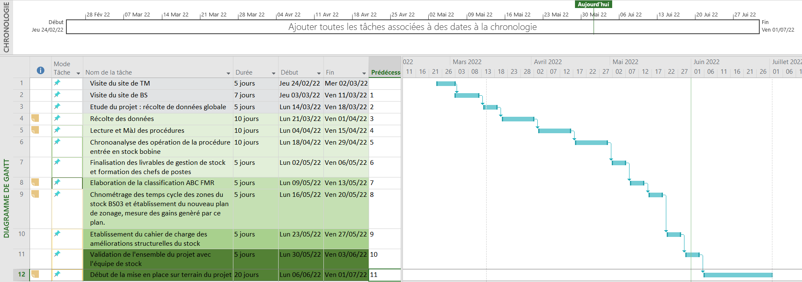

**Processus de logistique aval au site Bled Solb**

**Réception des bobines :**

Après la sortie de la bobine de la machine de production Steckel, La bobine est déplacée par un pont roulant vers une zone de refroidissement pour une durée de 48h. La bobine refroidie subit un contrôle d’aspect et une identification dans la zone d’identification à la sortie du hangar, l’agent de stock marque les bobines suivant leurs destinations et colle les étiquettes d’identification sur les bobines.

**Mise en stock des bobines**

Le chariot élévateur déplace les bobines marquées vers les zones mentionnées sur la surface de la bobine, le zonage et l’adressage des lots se font suivant les destinations :

- Transfert (site logistique)

- Livraison locale

- Export

- Machines de réparation

- Stockage

**Inventaire et contrôle qualité**

Les bobines mises en stock subissent un inventaire mensuel ainsi que des inventaires par douchette au cas où une anomalie est détectée.

Le service contrôle qualité contrôle l’aspect des bobines mises en stock au fur et à mesure qu’un déplacement ou une transformation est effectué sur la bobine, et ceci avant que la bobine soit affectée à une livraison par l’ADV.

**Préparation des commandes et livraison**

Les bobines de conformité validée sont mises sur le planning de livraison par le responsable planification

Les bobines à destination de l’export conteneur sont préparées sur la zone de préparation, les bobines à destination du transfert vers le site logistique ou vers la livraison des clients locaux et export conventionnel ne subissent pas une préparation des lots, les camions sont chargés directement par les chariots élévateurs dédiés.

Les bobines chargées sur les camions subissent un dernier contrôle avant le pesage final et l’expédition.

**Logigramme du processus de la logistique aval**

**Pour mieux comprendre et avoir une vue globale sur le processus de la logistique aval du site,j’ai réalisé un logigramme grace à l’outil MS VISIO**

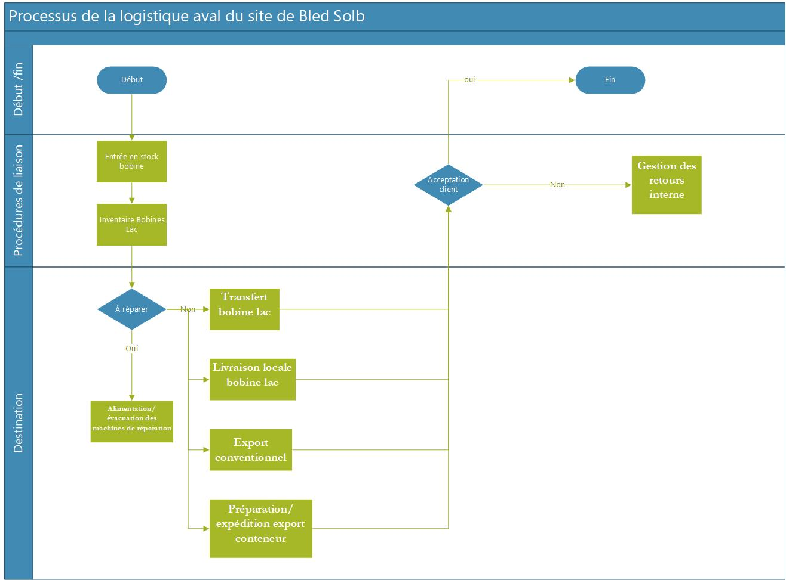

**Périmètre du projet**

Le projet s’encadre entre a zone de production des bobines et le pont-bascule de sortie de livraison et passe par :

- La zone de refroidissement des bobines (ZR)

- La zone d’identification des bobines (ZI)

- Stock extérieur bobines Lac BS03

- Pont-bascule de sortie des camions

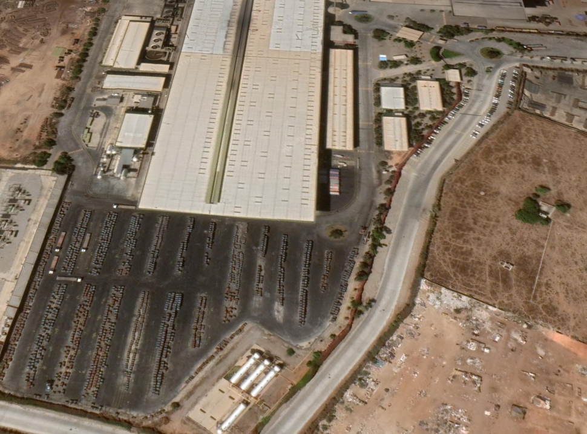**États des lieux et objectifs**

L’état des lieux que j’ai effectué a montré des pistes d’améliorations sur plusieurs points au niveau du périmètre du projet :

**Le zoning et l’adressage des lots**

Cette phase s’effectue entre le moment de l’étiquetage des bobines et leurs mises en stock.

Chaque jour une fiche de déplacement des bobines est imprimée, cette fiche contient le programme de déplacement journalier des bobines entre la zone d’identification et l’emplacement de stockage.

Le chauffeur est accompagné par un agent de stock qui remplit la fiche de déplacement au fur et à mesure du remplissage du stock.

Ce que j’ai remarqué dans cette opération, c’est que le programme de déplacement n’est jamais satisfait, et le taux d’accomplissement du programme n’aboutit jamais à 100%

Voir (ANNEXE 1)

#### Inventaire BOBINES LAC

L’inventaire des bobines se divise en deux types :

Inventaire correctif

Inventaire mensuel

Cette procédure s’effectue par le biais d’une « douchette » connectée à l’application de gestion de stock, le dispositif scan les code-barre sur les étiquettes et détecte les anomalies liées aux numéros de lots

A ce propos, j’ai constaté la présence des écarts de stock signifiante au niveau du stock BS03.

**Le marquage des zones et l’état de l’infrastructure**

Le marquage des zones et des couloirs du stock sont considérés comme l’un des éléments importants pour l’identification des bobines ainsi que dans le zoning et l’inventaire.

Le marquage actuel n’est pas clair et a été enlevé à cause des déplacements des chariots élévateurs et camions de livraison ce qui complique les tâches des agents de manutentions et les agents d’inventaire.

L’état du sol est détérioré à cause des conditions climatiques ainsi que les déplacements des différents engins, comme le montrent les photos suivantes :

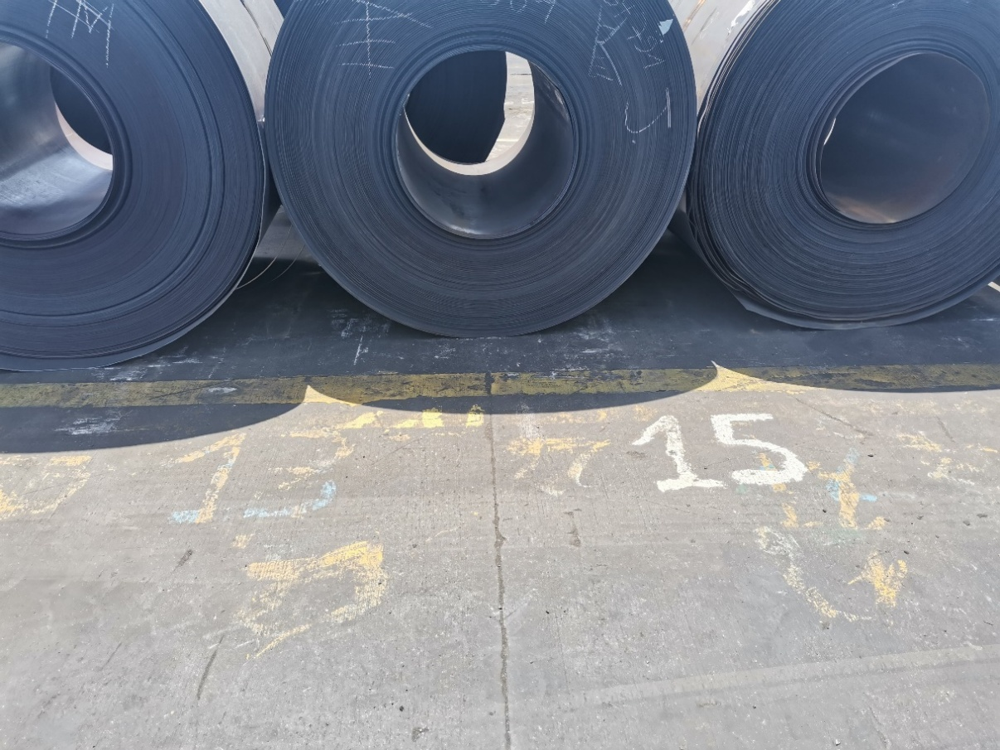

Figure 25 : Photo illustrative du marquage du sol 1

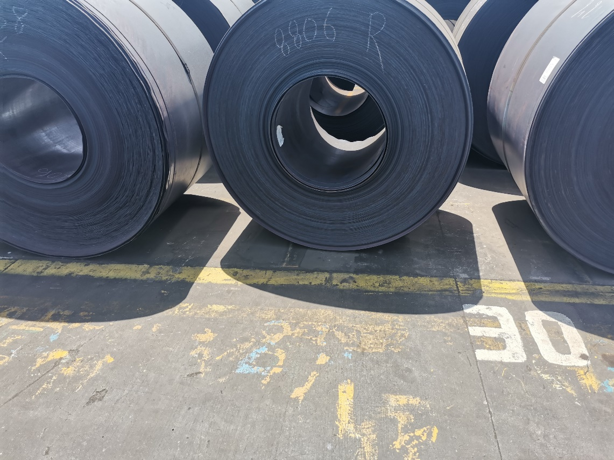

Figure 26 : Photo illustrative du marquage du sol 2

**Le désordre dans la mise en place des bobines**

L’absence des SKID de maintien des bobines au niveau du stock (support des bobines) cause un désordre des bobines au niveau du stock :

- Les lignes ne sont pas bien respectées

- Les positions sont décalées

Ce qui implique la non-exploitation de la totalité de la capacité du stock 

**Plan de zonage**

L’agent du zoning suit le plan suivant pour la mise en stock des bobines :

| **Destination**                                               | **Épaisseur (en mm)** |       | **Largeur (en mm)** |       | **Zone** |
|---------------------------------------------------------------|-----------------------|-------|---------------------|-------|----------|
| ** **                                                         | **De**                | **A** | **De**              | **A** | ** **    |
| Bobines client                                                | \_                    | \_    | 1500                |       | S        |
| Bobine client strie / larme                                   | \_                    | \_    | 990                 | 1500  | A        |
| Bobine client                                                 | \_                    | \_    | 1250                | 1290  | B        |
| Bobine client                                                 | \_                    | \_    | 1000                | 1040  | C        |
| Bobine client strie / larme                                   | \_                    | \_    | 990                 | 1500  | D        |
| Bobines Réparées RF1 & RF7 poids≤ 12T                         | \_                    | \_    | 990                 | 1270  | E        |
| Transfert & Stock                                             | 2,7                   | 2,7   | 1000                | 1040  | F        |
|                                                               | 2,8                   | 2,8   | 1000                | 1040  | F        |
|                                                               | 3                     | 3     | 1000                | 1040  | F        |
|                                                               | 3,4                   | 3,4   | 1000                | 1040  | F        |
|                                                               | 3,6                   | 3,8   | 1000                | 1040  | F        |
| Bobines réservées à Renault                                   | \_                    | \_    | 1040                | 1100  | I        |
| Bobines réservées au transfert                                | \_                    | \_    | 1040                | 1275  | I        |
| Transfert & stock                                             | 2,7                   | 2,7   | 1250                | 1290  | G        |
|                                                               | 2,8                   | 2,8   | 1250                | 1290  | G        |
|                                                               | 3                     | 3     | 1250                | 1290  | G        |
|                                                               | 3,4                   | 3,4   | 1250                | 1290  | G        |
|                                                               | 3,6                   | 3,6   | 1250                | 1290  | G        |
| Bobines Réparées RF1 & RF7 poids\>12T                         | \_                    | \_    | 1500                |       | H        |
| Fine épaisseur client                                         | 1,6                   | 2,4   | 1000                | 1500  | J        |
| Fine épaisseur transfert & stock                              | 1,6                   | 2,4   | 1000                | 1290  | K        |
| Fine épaisseur transfert & stock                              | 1,6                   | 2,4   | 1000                | 1290  | R        |
| Bobines déformées UP COILER évacuées par le chariot élévateur | \_                    | \_    | \_                  | \_    | L        |
| Bobines Réparées RF1 & RF7 poids≤ 12T                         | \_                    | \_    | 1500                | 1500  | M        |
| Stock                                                         | \_                    | \_    | 1490                | 1510  | N        |
| Bobines Réparées RF1 & RF7 poids≤ 12T                         | \_                    | \_    | 1000                | 1290  | O        |
| Bobines Réparées RF1 & RF7 poids\>12T                         | \_                    | \_    | 1100                | 1290  | P        |
| Bobines Réparées RF1 & RF7 poids\>12T                         | \_                    | \_    | 980                 | 1090  | Q        |

Tableau 5 : ancien plan de zonage

**Cartographie du stock**

Suivant ce plan de zonage, la cartographie du stock est comme suit :

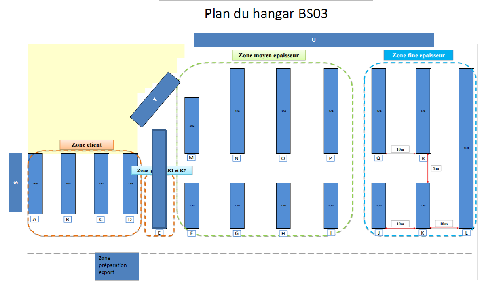

**Objectifs à atteindre :**

Ce projet a pour but d’effectuer une réorganisation optimale du plan de zonage ainsi que la cartographie du stock en fonction de la rotation des différentes références de bobines LAC. Ceci permettra d’améliorer le temps de cycle global pour la mise en stock des bobines LAC afin de gagner en termes de couts logistiques et de disponibilité.

**Mesurer**

**Brainstorming et benchmarking**

Après une série de visites au sein des différents départements que ce soit sur le site logistique ou celui de production, une réunion de brainstorming a été programmée pour proposer les idées de résolution des problématiques des stocks du site de production.Toute l’équipe de stock a été présente pour assurer un maximum de partage.

Les stocks du site Bled Solb se divise en trois selon la catégorie du produit : (Bobines LAC, brame, tôle), pour faire un ordre de priorité j’ai procédé par un vote.

En fin de la réunion, on s’est mis d’accord que le projet se focalisera sur l’optimisation et l’amélioration des stocks de produits finis **Bobine Lac** suivant la priorisation mise en place.

**Mesure des temps cycle :**

Tout d’abord, je me suis intéressé à la collecte de données concernant l’opération d’évacuation des bobines LAC vers le stock extérieur BS03. Cette opération est effectuée chaque jour à l’aide du chariot élévateur de bobine.

A ce propos, j’ai mesuré toutes les distances parcourues par l’engin vers les différentes zones, ainsi que les temps de cycle associés dans le tableau suivant :

|     | Zone | Distance depuis la sortie du hangar (m) | Temps cycle (secondes) | Nombres de bobines par zone |
|-----|------|-----------------------------------------|------------------------|-----------------------------|
| 1   | G1   | 26                                      | 86                     | 110                         |
| 2   | F1   | 31                                      | 86                     | 110                         |
| 3   | H1   | 41                                      | 106                    | 138                         |
| 4   | E1   | 47                                      | 110                    | 220                         |
| 5   | G2   | 48                                      | 96                     | 110                         |
| 6   | F2   | 54                                      | 96                     | 110                         |
| 7   | I1   | 60                                      | 120                    | 118                         |
| 8   | H2   | 61                                      | 116                    | 138                         |
| 9   | I2   | 81                                      | 140                    | 118                         |
| 10  | J1   | 83                                      | 162                    | 60                          |
| 11  | E2   | 83                                      | 162                    | 220                         |
| 12  | D    | 84                                      | 122                    | 180                         |
| 13  | M    | 88                                      | 145                    | 164                         |
| 14  | K1   | 91                                      | 150                    | 60                          |
| 15  | N1   | 96                                      | 148                    | 160                         |
| 16  | C    | 99                                      | 155                    | 144                         |
| 17  | J2   | 104                                     | 170                    | 60                          |
| 18  | O1   | 108                                     | 175                    | 186                         |
| 19  | K2   | 118                                     | 160                    | 60                          |
| 20  | N2   | 118                                     | 170                    | 160                         |
| 21  | B    | 120                                     | 130                    | 126                         |
| 22  | S    | 125                                     | 150                    | 62                          |
| 23  | A    | 125                                     | 144                    | 66                          |
| 24  | P1   | 127                                     | 150                    | 172                         |
| 25  | O2   | 130                                     | 197                    | 186                         |
| 26  | T    | 133                                     | 169                    | 70                          |
| 27  | Q1   | 148                                     | 190                    | 84                          |
| 28  | R1   | 165                                     | 203                    | 86                          |
| 29  | P2   | 168                                     | 202                    | 172                         |
| 30  | Q2   | 187                                     | 234                    | 84                          |
| 31  | R2   | 193                                     | 255                    | 86                          |
| 32  | U    | 202                                     | 250                    | 55                          |
| 33  | L    | Cobble                                  |                        | 144                         |

**La classification ABC **

Il existe plusieurs références qui sont réparties selon les cinq destinations suivantes :

- Bobines destinées au **transfert** pour le site logistique.

- Bobines destinées à la **consommation** (bobines à réparer).

- Bobines destinées à la livraison **locale**.

- Bobines destinées à l’**export**.

- Bobines destinées au **stockage**.

Dans le but de savoir la classification des destinations ainsi que les références associées en se basant sur le critère du poids total pour chaque destination. J’étais amené à déposer une demande d’une base de données contenant la rotation des bobines stockées à BS03 durant les 12 derniers mois comme le montre l’échantillon suivant :

| Nlot      | Destination | Ep   | Largeur | Poidsnet | Codmac | dateprod                | Grade |
|-----------|-------------|------|---------|----------|--------|-------------------------|-------|
| 71134371  | Cons        | 1.60 | 1000.0  | 14840    | STM    | 2021-07-02 00:00:00.000 | R     |
| 71134381  | Cons        | 1.60 | 1000.0  | 14850    | STM    | 2021-07-02 00:00:00.000 | R     |
| 71134931  | Cons        | 1.60 | 1000.0  | 14820    | STM    | 2021-07-02 00:00:00.000 | R     |
| 71134651  | Locale      | 1.60 | 1000.0  | 14810    | STM    | 2021-07-02 00:00:00.000 | R     |
| 71134361  | Stock       | 1.60 | 990.0   | 14810    | STM    | 2021-07-02 00:00:00.000 | R     |
| 71134631  | Stock       | 1.60 | 990.0   | 14770    | STM    | 2021-07-02 00:00:00.000 | R     |
| 71134661  | Stock       | 1.60 | 1000.0  | 14820    | STM    | 2021-07-02 00:00:00.000 | R     |
| 71134641  | Transfert   | 1.60 | 1000.0  | 14600    | STM    | 2021-07-02 00:00:00.000 | R     |
| 71134921  | Transfert   | 1.60 | 1000.0  | 14760    | STM    | 2021-07-02 00:00:00.000 | R     |
| 71134941  | Transfert   | 1.60 | 1000.0  | 14770    | STM    | 2021-07-02 00:00:00.000 | R     |
| 71134951  | Transfert   | 1.60 | 1000.0  | 14810    | STM    | 2021-07-02 00:00:00.000 | R     |
| 351057851 | Cons        | 1.60 | 990.0   | 15040    | RMN    | 2021-09-13 00:00:00.000 | N     |
| 341051081 | Locale      | 1.60 | 1000.0  | 13120    | RFB    | 2021-10-23 00:00:00.000 | R     |
| 341051121 | Locale      | 1.60 | 1000.0  | 11940    | RFB    | 2021-10-23 00:00:00.000 | U     |
| 341051071 | Cons        | 1.60 | 1000.0  | 12630    | RFB    | 2021-10-25 00:00:00.000 | N     |
| 341051101 | Cons        | 1.60 | 1000.0  | 13750    | RFB    | 2021-10-25 00:00:00.000 | N     |
| 351064201 | Cons        | 1.60 | 990.0   | 14950    | RMN    | 2021-10-25 00:00:00.000 | N     |
| 341051061 | Locale      | 1.60 | 1000.0  | 12380    | RFB    | 2021-10-25 00:00:00.000 | R     |
| 341051091 | Locale      | 1.60 | 1000.0  | 12360    | RFB    | 2021-10-25 00:00:00.000 | R     |
| 341051111 | Locale      | 1.60 | 1000.0  | 12060    | RFB    | 2021-10-25 00:00:00.000 | R     |
| 351068521 | Locale      | 1.60 | 1000.0  | 13730    | RMN    | 2021-11-08 00:00:00.000 | 1     |
| 351068511 | Locale      | 1.60 | 1000.0  | 12620    | RMN    | 2021-11-09 00:00:00.000 | 1     |

Tableau 8 : Extrait de la base de données de rotation des 12 derniers mois

À travers cette base de données, j’ai réalisé un tableau croisé dynamique contenant les destinations et les épaisseurs en ligne et en valeur la somme des poids nets.

En exploitant les poids de chaque référence et le poids total, j’ai calculé les pourcentages des poids nets de chaque référence et les pourcentages des poids nets cumulés pour déduire la classe de chaque référence par la formule affichée sur le document Excel en annexe 2.

Donc j’ai réalisé une classification ABC pour toutes les destinations. Dans chaque destination j’ai réalisé une classification ABC afin de savoir les références dont la rotation est importante.

|     | Poids total              | 324776349              |                     |                             |     |                                 |
|-----|--------------------------|------------------------|---------------------|-----------------------------|-----|---------------------------------|
|     | **Nbre de références**   | **289**                |                     |                             |     |                                 |
| ID  | **Étiquettes de lignes** | **Somme de Poids net** | **% des poids net** | **% des poids net cumulés** | ABC | **% des poids par destination** |
|     | **Transfert**            | **118436588**          |                     |                             |     | **36%**                         |
| 1   | 2.20                     | 27973238               | 24%                 | 24%                         | A   |                                 |
| 2   | 2.00                     | 20861810               | 18%                 | 41%                         | A   |                                 |
| 3   | 2.70                     | 17217280               | 15%                 | 56%                         | A   |                                 |
| 4   | 2.40                     | 16789540               | 14%                 | 70%                         | A   |                                 |
| 5   | 3.00                     | 13766600               | 12%                 | 82%                         | A   |                                 |
| 6   | 3.40                     | 11384470               | 10%                 | 91%                         | B   |                                 |
| 7   | 3.60                     | 3636340                | 3%                  | 94%                         | B   |                                 |
| 8   | 2.50                     | 2481890                | 2%                  | 96%                         | C   |                                 |
| 9   | 4.00                     | 991940                 | 1%                  | 97%                         | C   |                                 |
| 10  | 2.80                     | 756610                 | 1%                  | 98%                         | C   |                                 |
| 11  | 2.60                     | 508500                 | 0%                  | 98%                         | C   |                                 |
| 12  | 2.85                     | 355260                 | 0%                  | 99%                         | C   |                                 |
| 13  | 2.90                     | 316160                 | 0%                  | 99%                         | C   |                                 |
| 14  | 2.10                     | 312860                 | 0%                  | 99%                         | C   |                                 |
| 15  | 1.80                     | 226130                 | 0%                  | 99%                         | C   |                                 |
| 16  | 3.80                     | 177230                 | 0%                  | 99%                         | C   |                                 |
| 17  | 2.16                     | 162850                 | 0%                  | 100%                        | C   |                                 |
| 18  | 2.25                     | 107940                 | 0%                  | 100%                        | C   |                                 |
| 19  | 3.50                     | 101080                 | 0%                  | 100%                        | C   |                                 |
| 20  | 2.30                     | 65720                  | 0%                  | 100%                        | C   |                                 |
| 21  | 1.60                     | 58940                  | 0%                  | 100%                        | C   |                                 |
| 22  | 4.20                     | 56680                  | 0%                  | 100%                        | C   |                                 |
| 23  | 3.20                     | 53230                  | 0%                  | 100%                        | C   |                                 |
| 24  | 2.75                     | 32300                  | 0%                  | 100%                        | C   |                                 |
| 25  | 4.50                     | 21600                  | 0%                  | 100%                        | C   |                                 |
| 26  | 1.90                     | 20390                  | 0%                  | 100%                        | C   |                                 |

Tableau 9 : Classification ABC de la destination transfert

|     | Étiquettes de lignes | Somme de Poids net(Kg) | % des poids net | % des poids net cumulés | ABC | % des poids par destination |
|-----|----------------------|------------------------|-----------------|-------------------------|-----|-----------------------------|
|     | **Consommation**     | **114943210**          |                 |                         |     | **35%**                     |
| 27  | 3.00                 | 13241340               | 12%             | 12%                     | A   |                             |
| 28  | 3.40                 | 10418090               | 9%              | 21%                     | A   |                             |
| 29  | 2.00                 | 10056500               | 9%              | 29%                     | A   |                             |
| 30  | 2.40                 | 6596880                | 6%              | 35%                     | A   |                             |
| 31  | 2.20                 | 6014870                | 5%              | 40%                     | A   |                             |
| 32  | 3.80                 | 5146180                | 4%              | 45%                     | A   |                             |
| 33  | 2.70                 | 4851310                | 4%              | 49%                     | A   |                             |
| 34  | 4.00                 | 4835220                | 4%              | 53%                     | A   |                             |
| 35  | 6.00                 | 3946720                | 3%              | 57%                     | A   |                             |
| 36  | 5.00                 | 3740430                | 3%              | 60%                     | A   |                             |
| 37  | 1.80                 | 3360160                | 3%              | 63%                     | A   |                             |
| 38  | 2.50                 | 3118470                | 3%              | 66%                     | A   |                             |
| 39  | 2.80                 | 3087550                | 3%              | 68%                     | A   |                             |
| 40  | 2.85                 | 3039530                | 3%              | 71%                     | A   |                             |
| 41  | 3.60                 | 2911610                | 3%              | 73%                     | A   |                             |
| 42  | 1.90                 | 2814710                | 2%              | 76%                     | A   |                             |
| 43  | 2.75                 | 2729960                | 2%              | 78%                     | A   |                             |
| 44  | 4.60                 | 2025260                | 2%              | 80%                     | A   |                             |
| 45  | 3.65                 | 1630160                | 1%              | 81%                     | A   |                             |
| 46  | 8.00                 | 1490550                | 1%              | 83%                     | B   |                             |
| 47  | 4.80                 | 1399520                | 1%              | 84%                     | B   |                             |
| 48  | 2.60                 | 1141400                | 1%              | 85%                     | B   |                             |
| 49  | 10.00                | 1094140                | 1%              | 86%                     | B   |                             |
| 50  | 5.45                 | 1084810                | 1%              | 87%                     | B   |                             |
| 51  | 7.40                 | 1069820                | 1%              | 88%                     | B   |                             |
| 52  | 3.50                 | 1009980                | 1%              | 89%                     | B   |                             |
| 53  | 4.45                 | 987840                 | 1%              | 89%                     | B   |                             |
| 54  | 5.60                 | 975340                 | 1%              | 90%                     | B   |                             |
| 55  | 5.80                 | 902000                 | 1%              | 91%                     | B   |                             |
| 56  | 2.30                 | 818340                 | 1%              | 92%                     | B   |                             |
| 57  | 2.90                 | 803190                 | 1%              | 93%                     | B   |                             |
| 58  | 3.20                 | 737240                 | 1%              | 93%                     | B   |                             |
| 59  | 4.50                 | 723760                 | 1%              | 94%                     | B   |                             |
| 60  | 2.72                 | 590460                 | 1%              | 94%                     | B   |                             |
| 61  | 3.90                 | 589480                 | 1%              | 95%                     | B   |                             |
| 62  | 15.50                | 538840                 | 0%              | 95%                     | C   |                             |
| 63  | 3.62                 | 516230                 | 0%              | 96%                     | C   |                             |
| 64  | 20.00                | 509410                 | 0%              | 96%                     | C   |                             |
| 65  | 3.57                 | 508380                 | 0%              | 97%                     | C   |                             |
| 66  | 2.10                 | 450560                 | 0%              | 97%                     | C   |                             |
| 67  | 4.55                 | 438640                 | 0%              | 97%                     | C   |                             |
| 68  | 15.00                | 427560                 | 0%              | 98%                     | C   |                             |
| 69  | 3.15                 | 417060                 | 0%              | 98%                     | C   |                             |
| 70  | 12.00                | 386380                 | 0%              | 98%                     | C   |                             |
| 71  | 4.62                 | 291470                 | 0%              | 99%                     | C   |                             |
| 72  | 4.10                 | 201450                 | 0%              | 99%                     | C   |                             |
| 73  | 18.00                | 181760                 | 0%              | 99%                     | C   |                             |
| 74  | 2.25                 | 179160                 | 0%              | 99%                     | C   |                             |
| 75  | 3.70                 | 156780                 | 0%              | 99%                     | C   |                             |
| 76  | 5.85                 | 152530                 | 0%              | 99%                     | C   |                             |
| 77  | 2.65                 | 133380                 | 0%              | 100%                    | C   |                             |
| 78  | 1.60                 | 100880                 | 0%              | 100%                    | C   |                             |
| 79  | 6.65                 | 90250                  | 0%              | 100%                    | C   |                             |
| 80  | 16.00                | 80060                  | 0%              | 100%                    | C   |                             |
| 81  | 2.16                 | 69920                  | 0%              | 100%                    | C   |                             |
| 82  | 1.85                 | 44460                  | 0%              | 100%                    | C   |                             |
| 83  | 4.20                 | 41130                  | 0%              | 100%                    | C   |                             |
| 84  | 3.31                 | 23630                  | 0%              | 100%                    | C   |                             |
| 85  | 2.45                 | 20470                  | 0%              | 100%                    | C   |                             |

Tableau 10 : Classification ABC de la destination Consommation

|     | Étiquettes de lignes | Somme de Poids net (Kg) | % des poids net | % des poids net cumulés | ABC | % des poids par destination |
|-----|----------------------|-------------------------|-----------------|-------------------------|-----|-----------------------------|
|     | **Local**            | **57811929**            |                 |                         |     | **18%**                     |
| 86  | 3.80                 | 6318490                 | 11%             | 11%                     | A   |                             |
| 87  | 2.80                 | 4888070                 | 8%              | 19%                     | A   |                             |
| 88  | 3.00                 | 3575010                 | 6%              | 26%                     | A   |                             |
| 89  | 2.40                 | 3487590                 | 6%              | 32%                     | A   |                             |
| 90  | 2.85                 | 3084670                 | 5%              | 37%                     | A   |                             |
| 91  | 1.90                 | 2772850                 | 5%              | 42%                     | A   |                             |
| 92  | 6.00                 | 2766410                 | 5%              | 47%                     | A   |                             |
| 93  | 2.70                 | 2756590                 | 5%              | 51%                     | A   |                             |
| 94  | 2.00                 | 2731380                 | 5%              | 56%                     | A   |                             |
| 95  | 5.00                 | 2359680                 | 4%              | 60%                     | A   |                             |
| 96  | 1.80                 | 2228190                 | 4%              | 64%                     | A   |                             |
| 97  | 4.80                 | 2173170                 | 4%              | 68%                     | A   |                             |
| 98  | 4.00                 | 2072830                 | 4%              | 71%                     | A   |                             |
| 99  | 2.20                 | 1891530                 | 3%              | 75%                     | A   |                             |
| 100 | 10.00                | 1414550                 | 2%              | 77%                     | A   |                             |
| 101 | 8.00                 | 1392470                 | 2%              | 79%                     | A   |                             |
| 102 | 3.50                 | 1082820                 | 2%              | 81%                     | A   |                             |
| 103 | 3.40                 | 1032620                 | 2%              | 83%                     | B   |                             |
| 104 | 2.50                 | 1015080                 | 2%              | 85%                     | B   |                             |
| 105 | 5.80                 | 855020                  | 1%              | 86%                     | B   |                             |
| 106 | 3.20                 | 837660                  | 1%              | 88%                     | B   |                             |
| 107 | 4.50                 | 782230                  | 1%              | 89%                     | B   |                             |
| 108 | 2.90                 | 681140                  | 1%              | 90%                     | B   |                             |
| 109 | 4.60                 | 506460                  | 1%              | 91%                     | B   |                             |
| 110 | 3.90                 | 495570                  | 1%              | 92%                     | B   |                             |
| 111 | 2.72                 | 379020                  | 1%              | 93%                     | B   |                             |
| 112 | 2.30                 | 377369                  | 1%              | 93%                     | B   |                             |
| 113 | 12.00                | 343420                  | 1%              | 94%                     | B   |                             |
| 114 | 3.60                 | 323460                  | 1%              | 94%                     | B   |                             |
| 115 | 2.75                 | 289490                  | 1%              | 95%                     | B   |                             |
| 116 | 7.40                 | 189290                  | 0%              | 95%                     | C   |                             |
| 117 | 5.45                 | 166030                  | 0%              | 96%                     | C   |                             |
| 118 | 3.70                 | 163240                  | 0%              | 96%                     | C   |                             |
| 119 | 3.15                 | 159540                  | 0%              | 96%                     | C   |                             |
| 120 | 3.65                 | 127460                  | 0%              | 96%                     | C   |                             |
| 121 | 1.60                 | 117920                  | 0%              | 97%                     | C   |                             |
| 122 | 2.60                 | 116710                  | 0%              | 97%                     | C   |                             |
| 123 | 15.50                | 108310                  | 0%              | 97%                     | C   |                             |
| 124 | 4.45                 | 105640                  | 0%              | 97%                     | C   |                             |
| 125 | 9.00                 | 104710                  | 0%              | 97%                     | C   |                             |
| 126 | 4.62                 | 102960                  | 0%              | 98%                     | C   |                             |
| 127 | 5.60                 | 95440                   | 0%              | 98%                     | C   |                             |
| 128 | 15.00                | 93880                   | 0%              | 98%                     | C   |                             |
| 129 | 9.50                 | 87600                   | 0%              | 98%                     | C   |                             |
| 130 | 1.85                 | 87530                   | 0%              | 98%                     | C   |                             |
| 131 | 2.65                 | 64410                   | 0%              | 98%                     | C   |                             |
| 132 | 10.01                | 56080                   | 0%              | 98%                     | C   |                             |
| 133 | 18.00                | 49430                   | 0%              | 98%                     | C   |                             |
| 134 | 3.62                 | 44310                   | 0%              | 99%                     | C   |                             |
| 135 | 5.85                 | 42650                   | 0%              | 99%                     | C   |                             |
| 136 | 16.00                | 39990                   | 0%              | 99%                     | C   |                             |
| 137 | 3.57                 | 36710                   | 0%              | 99%                     | C   |                             |
| 138 | 8.98                 | 35870                   | 0%              | 99%                     | C   |                             |
| 139 | 4.20                 | 35300                   | 0%              | 99%                     | C   |                             |
| 140 | 10.02                | 34950                   | 0%              | 99%                     | C   |                             |
| 141 | 2.10                 | 26830                   | 0%              | 99%                     | C   |                             |
| 142 | 3.24                 | 23500                   | 0%              | 99%                     | C   |                             |
| 143 | 6.92                 | 23130                   | 0%              | 99%                     | C   |                             |
| 144 | 9.02                 | 22190                   | 0%              | 99%                     | C   |                             |
| 145 | 4.44                 | 22020                   | 0%              | 99%                     | C   |                             |
| 146 | 3.21                 | 21200                   | 0%              | 99%                     | C   |                             |
| 147 | 5.42                 | 21010                   | 0%              | 99%                     | C   |                             |
| 148 | 9.51                 | 20750                   | 0%              | 99%                     | C   |                             |
| 149 | 6.76                 | 20140                   | 0%              | 99%                     | C   |                             |
| 150 | 6.65                 | 19970                   | 0%              | 99%                     | C   |                             |
| 151 | 3.28                 | 19570                   | 0%              | 99%                     | C   |                             |
| 152 | 3.18                 | 19450                   | 0%              | 99%                     | C   |                             |
| 153 | 3.27                 | 19130                   | 0%              | 99%                     | C   |                             |
| 154 | 4.51                 | 18880                   | 0%              | 99%                     | C   |                             |
| 155 | 3.88                 | 18020                   | 0%              | 99%                     | C   |                             |
| 156 | 3.44                 | 17580                   | 0%              | 99%                     | C   |                             |
| 157 | 3.11                 | 17360                   | 0%              | 100%                    | C   |                             |
| 158 | 4.38                 | 17330                   | 0%              | 100%                    | C   |                             |
| 159 | 4.05                 | 16590                   | 0%              | 100%                    | C   |                             |
| 160 | 4.32                 | 16310                   | 0%              | 100%                    | C   |                             |
| 161 | 17.86                | 15480                   | 0%              | 100%                    | C   |                             |
| 162 | 5.24                 | 15470                   | 0%              | 100%                    | C   |                             |
| 163 | 4.17                 | 15170                   | 0%              | 100%                    | C   |                             |
| 164 | 4.34                 | 13720                   | 0%              | 100%                    | C   |                             |
| 165 | 3.34                 | 13460                   | 0%              | 100%                    | C   |                             |
| 166 | 3.17                 | 13300                   | 0%              | 100%                    | C   |                             |
| 167 | 4.48                 | 12780                   | 0%              | 100%                    | C   |                             |
| 168 | 3.02                 | 12360                   | 0%              | 100%                    | C   |                             |
| 169 | 1.65                 | 11900                   | 0%              | 100%                    | C   |                             |
| 170 | 2.25                 | 11690                   | 0%              | 100%                    | C   |                             |
| 171 | 3.16                 | 11570                   | 0%              | 100%                    | C   |                             |
| 172 | 7.76                 | 11500                   | 0%              | 100%                    | \-  |                             |
| 173 | 3.66                 | 9220                    | 0%              | 100%                    | C   |                             |
| 174 | 9.97                 | 8590                    | 0%              | 100%                    | C   |                             |
| 175 | 4.15                 | 8310                    | 0%              | 100%                    | C   |                             |
| 176 | 27.81                | 8240                    | 0%              | 100%                    | C   |                             |
| 177 | 3.37                 | 7050                    | 0%              | 100%                    | C   |                             |
| 178 | 3.25                 | 6670                    | 0%              | 100%                    | C   |                             |
| 179 | 4.55                 | 6480                    | 0%              | 100%                    | C   |                             |
| 180 | 5.46                 | 6400                    | 0%              | 100%                    | C   |                             |
| 181 | 3.23                 | 6180                    | 0%              | 100%                    | C   |                             |
| 182 | 4.26                 | 4630                    | 0%              | 100%                    | C   |                             |

Tableau 11 : Classification ABC destination Livraison locale

|     | Étiquettes de lignes | Somme de Poids net(Kg) | % des poids net | % des poids net cumulés | ABC | % des poids par destination |
|-----|----------------------|------------------------|-----------------|-------------------------|-----|-----------------------------|
|     | **Export**           | **32564532**           |                 |                         |     | **10%**                     |
| 183 | 4.00                 | 2584530                | 8%              | 8%                      | A   |                             |
| 184 | 2.00                 | 2305860                | 7%              | 15%                     | A   |                             |
| 185 | 3.00                 | 2257600                | 7%              | 22%                     | A   |                             |
| 186 | 2.75                 | 2103620                | 6%              | 28%                     | A   |                             |
| 187 | 4.60                 | 1961700                | 6%              | 34%                     | A   |                             |
| 188 | 3.65                 | 1692730                | 5%              | 40%                     | A   |                             |
| 189 | 5.00                 | 1445560                | 4%              | 44%                     | A   |                             |
| 190 | 2.50                 | 1441660                | 4%              | 48%                     | A   |                             |
| 191 | 1.80                 | 1304270                | 4%              | 53%                     | A   |                             |
| 192 | 7.40                 | 1069310                | 3%              | 56%                     | A   |                             |
| 193 | 5.45                 | 958940                 | 3%              | 59%                     | A   |                             |
| 194 | 2.72                 | 787840                 | 2%              | 61%                     | A   |                             |
| 195 | 6.00                 | 748270                 | 2%              | 63%                     | A   |                             |
| 196 | 2.20                 | 702500                 | 2%              | 66%                     | A   |                             |
| 197 | 4.45                 | 696600                 | 2%              | 68%                     | A   |                             |
| 198 | 8.00                 | 681280                 | 2%              | 70%                     | A   |                             |
| 199 | 2.80                 | 674270                 | 2%              | 72%                     | A   |                             |
| 200 | 5.60                 | 663410                 | 2%              | 74%                     | A   |                             |
| 201 | 2.40                 | 656320                 | 2%              | 76%                     | A   |                             |
| 202 | 15.50                | 575880                 | 2%              | 78%                     | A   |                             |
| 203 | 2.70                 | 537150                 | 2%              | 79%                     | A   |                             |
| 204 | 10.00                | 529080                 | 2%              | 81%                     | A   |                             |
| 205 | 3.62                 | 506690                 | 2%              | 83%                     | B   |                             |
| 206 | 2.30                 | 487492                 | 1%              | 84%                     | B   |                             |
| 207 | 4.55                 | 456400                 | 1%              | 85%                     | B   |                             |
| 208 | 3.57                 | 399450                 | 1%              | 87%                     | B   |                             |
| 209 | 2.90                 | 348180                 | 1%              | 88%                     | B   |                             |
| 210 | 3.50                 | 341500                 | 1%              | 89%                     | B   |                             |
| 211 | 2.85                 | 300720                 | 1%              | 90%                     | B   |                             |
| 212 | 3.80                 | 297070                 | 1%              | 91%                     | B   |                             |
| 213 | 3.40                 | 289480                 | 1%              | 92%                     | B   |                             |
| 214 | 4.62                 | 267320                 | 1%              | 92%                     | B   |                             |
| 215 | 3.15                 | 233590                 | 1%              | 93%                     | B   |                             |
| 216 | 3.20                 | 202630                 | 1%              | 94%                     | B   |                             |
| 217 | 4.10                 | 198620                 | 1%              | 94%                     | B   |                             |
| 218 | 2.25                 | 180500                 | 1%              | 95%                     | B   |                             |
| 219 | 2.60                 | 171550                 | 1%              | 95%                     | C   |                             |
| 220 | 1.90                 | 158600                 | 0%              | 96%                     | C   |                             |
| 221 | 6.65                 | 148300                 | 0%              | 96%                     | C   |                             |
| 222 | 3.90                 | 144020                 | 0%              | 97%                     | C   |                             |
| 223 | 5.85                 | 133870                 | 0%              | 97%                     | C   |                             |
| 224 | 15.00                | 123810                 | 0%              | 98%                     | C   |                             |
| 225 | 20.00                | 99720                  | 0%              | 98%                     | C   |                             |
| 226 | 12.00                | 84670                  | 0%              | 98%                     | C   |                             |
| 227 | 2.10                 | 69410                  | 0%              | 98%                     | C   |                             |
| 228 | 9.50                 | 65750                  | 0%              | 99%                     | C   |                             |
| 229 | 10.01                | 56610                  | 0%              | 99%                     | C   |                             |
| 230 | 5.80                 | 43120                  | 0%              | 99%                     | C   |                             |
| 231 | 3.60                 | 41100                  | 0%              | 99%                     | C   |                             |
| 232 | 4.80                 | 39240                  | 0%              | 99%                     | C   |                             |
| 233 | 9.00                 | 38470                  | 0%              | 99%                     | C   |                             |
| 234 | 9.51                 | 29080                  | 0%              | 99%                     | C   |                             |
| 235 | 9.02                 | 22410                  | 0%              | 99%                     | C   |                             |
| 236 | 2.65                 | 19860                  | 0%              | 99%                     | C   |                             |
| 237 | 3.79                 | 18750                  | 0%              | 99%                     | C   |                             |
| 238 | 3.13                 | 16800                  | 0%              | 100%                    | C   |                             |
| 239 | 4.07                 | 16780                  | 0%              | 100%                    | C   |                             |
| 240 | 11.01                | 16580                  | 0%              | 100%                    | C   |                             |
| 241 | 12.01                | 16470                  | 0%              | 100%                    | C   |                             |
| 242 | 11.98                | 15780                  | 0%              | 100%                    | C   |                             |
| 243 | 6.40                 | 15110                  | 0%              | 100%                    | C   |                             |
| 244 | 11.53                | 12990                  | 0%              | 100%                    | C   |                             |
| 245 | 6.78                 | 12070                  | 0%              | 100%                    | C   |                             |
| 246 | 8.50                 | 11950                  | 0%              | 100%                    | C   |                             |
| 247 | 14.00                | 10260                  | 0%              | 100%                    | C   |                             |
| 248 | 3.70                 | 10160                  | 0%              | 100%                    | C   |                             |
| 249 | 18.09                | 6950                   | 0%              | 100%                    | C   |                             |
| 250 | 7.30                 | 6270                   | 0%              | 100%                    | C   |                             |

Tableau 12 : Classification ABC de la destination Export

|     | Étiquettes de lignes | Somme de Poids net (Kg) | % des poids net | % des poids net cumulés | ABC | % des poids par destination |
|-----|----------------------|-------------------------|-----------------|-------------------------|-----|-----------------------------|
|     | **Stock**            | **1020090**             |                 |                         |     | 0%                          |
| 251 | 1.80                 | 118530                  | 12%             | 12%                     | A   |                             |
| 252 | 2.00                 | 99700                   | 10%             | 21%                     | A   |                             |
| 253 | 5.00                 | 88100                   | 9%              | 30%                     | A   |                             |
| 254 | 6.00                 | 53650                   | 5%              | 35%                     | A   |                             |
| 255 | 1.60                 | 44400                   | 4%              | 40%                     | A   |                             |
| 256 | 5.45                 | 43150                   | 4%              | 44%                     | A   |                             |
| 257 | 2.30                 | 40710                   | 4%              | 48%                     | A   |                             |
| 258 | 10.00                | 39930                   | 4%              | 52%                     | A   |                             |
| 259 | 3.80                 | 27700                   | 3%              | 54%                     | A   |                             |
| 260 | 11.00                | 25300                   | 2%              | 57%                     | A   |                             |
| 261 | 4.61                 | 24780                   | 2%              | 59%                     | A   |                             |
| 262 | 9.52                 | 23330                   | 2%              | 62%                     | A   |                             |
| 263 | 3.40                 | 23250                   | 2%              | 64%                     | A   |                             |
| 264 | 9.51                 | 23100                   | 2%              | 66%                     | A   |                             |
| 265 | 9.19                 | 21820                   | 2%              | 68%                     | A   |                             |
| 266 | 5.80                 | 21150                   | 2%              | 70%                     | A   |                             |
| 267 | 4.45                 | 21050                   | 2%              | 73%                     | A   |                             |
| 268 | 8.00                 | 19940                   | 2%              | 74%                     | A   |                             |
| 269 | 2.80                 | 19800                   | 2%              | 76%                     | A   |                             |
| 270 | 4.00                 | 19780                   | 2%              | 78%                     | A   |                             |
| 271 | 7.40                 | 19560                   | 2%              | 80%                     | A   |                             |
| 272 | 4.60                 | 19020                   | 2%              | 82%                     | B   |                             |
| 273 | 3.60                 | 17810                   | 2%              | 84%                     | B   |                             |
| 274 | 3.00                 | 17380                   | 2%              | 86%                     | B   |                             |
| 275 | 2.72                 | 14820                   | 1%              | 87%                     | B   |                             |
| 276 | 4.47                 | 14540                   | 1%              | 88%                     | B   |                             |
| 277 | 2.85                 | 14040                   | 1%              | 90%                     | B   |                             |
| 278 | 4.20                 | 12520                   | 1%              | 91%                     | B   |                             |
| 279 | 8.21                 | 11150                   | 1%              | 92%                     | B   |                             |
| 280 | 10.02                | 11000                   | 1%              | 93%                     | B   |                             |
| 281 | 1.90                 | 9710                    | 1%              | 94%                     | B   |                             |
| 282 | 2.70                 | 8940                    | 1%              | 95%                     | C   |                             |
| 283 | 2.40                 | 8580                    | 1%              | 96%                     | C   |                             |
| 284 | 3.36                 | 7940                    | 1%              | 97%                     | C   |                             |
| 285 | 3.15                 | 7770                    | 1%              | 97%                     | C   |                             |
| 286 | 9.48                 | 7500                    | 1%              | 98%                     | C   |                             |
| 287 | 3.59                 | 6720                    | 1%              | 99%                     | C   |                             |
| 288 | 2.90                 | 6090                    | 1%              | 99%                     | C   |                             |
| 289 | 3.05                 | 5830                    | 1%              | 100%                    | C   |                             |

Tableau 13 : Classification ABC de la destination stock

**Analyser :**

**Analyse par principe de Pareto :**

**Exploitation et interprétation des données de la classification :**

Après l’établissement de la classification ABC de chaque destination, il s’avère important d’interpréter les données fournies par cette étude et les exploiter au profit de l’objectif fixé au début du projet.

L’interprétation sera suivant deux outils, un tableau qui donne :

- Le pourcentage des poids net

- Le nombre de références par classe

- Le pourcentage des références par classe, par rapport au poids total des 6 derniers mois

- Le nombre d’emplacements par classe

Et le diagramme de Pareto de la classification.

La capacité totale du stock BS03 est de 3875 bobines.

##### Transfert

| **Code** | **%dePoidsNet** | **Nbre de références** | **% par classe** | **Emplacement par classe** |
|----------|-----------------|------------------------|------------------|----------------------------|
| **A**    | 82%             | 5                      | 30%              | 1153                       |
| **B**    | 95%             | 2                      | 5%               | 179                        |
| **C**    | \>95%           | 19                     | 2%               | 81                         |

Tableau 14 : Interprétation classification Transfert

La classification ABC de la destination transfert a donné :

Classe A : 5 références pour 82% de pourcentage de poids net, et 30% de pourcentage du poids net total. Le nombre de bobines nécessaire pour le stockage de cette classe est 1153.

Classe B : 2 références pour 13% de pourcentage de poids net, et 5% de pourcentage du poids net total. Le nombre de bobines nécessaire pour le stockage de cette classe est 179.

Classe C : 19 références pour 5% de pourcentage de poids net, et 2% de pourcentage du poids net total. Le nombre de bobines nécessaire pour le stockage de cette classe est 81.

Figure 29 : Diagramme de Pareto Transfert

##### Bobines de consommation

| **Code** | **%dePoidsNet** | **Nbre de références** | **% par classe** | **Emplacement par classe** |
|----------|-----------------|------------------------|------------------|----------------------------|
| **A**    | 82%             | 19                     | 29%              | 1116                       |
| **B**    | 95%             | 16                     | 5%               | 184                        |
| **C**    | \>95%           | 24                     | 2%               | 71                         |

Tableau 15 : Interprétation classification bobines de consommation

La classification ABC de la destination Bobine de consommation a donné :

Classe A : 19 références pour 82% de pourcentage de poids net, et 29% de pourcentage du poids net total. Le nombre de bobines nécessaire pour le stockage de cette classe est 1116.

Classe B : 16 références pour 13% de pourcentage de poids net, et 5% de pourcentage du poids net total. Le nombre de bobines nécessaire pour le stockage de cette classe est 184.

Classe C : 24 références pour 5% de pourcentage de poids net, et 2% de pourcentage du poids net total. Le nombre de bobines nécessaire pour le stockage de cette classe est 71.

Figure 30 : Diagramme de Pareto bobines de consommation

##### Livraison locale 

| **Code** | **%dePoidNet** | **Nbre de lot** | **% des lots** | **Emplacements par classe** |
|----------|----------------|-----------------|----------------|-----------------------------|
| **A**    | 82%            | 17              | 14%            | 561                         |
| **B**    | 95%            | 13              | 2%             | 94                          |
| **C**    | \>95%          | 66              | 1%             | 35                          |

Tableau 16 : Interprétation classification livraison locale

La classification ABC de la destination Bobine de consommation a donné :

Classe A : 17 références pour 82% de pourcentage de poids net, et 14% de pourcentage du poids net total. Le nombre de bobines nécessaire pour le stockage de cette classe est 561.

Classe B : 13 références pour 13% de pourcentage de poids net, et 2% de pourcentage du poids net total. Le nombre de bobines nécessaire pour le stockage de cette classe est 94.

Classe C : 66 références pour 5% de pourcentage de poids net, et 1% de pourcentage du poids net total. Le nombre de bobines nécessaire pour le stockage de cette classe est 35.

Figure 31 : Diagramme de Pareto Livraison locale

##### Export

| **Code** | **%dePoidsNet** | **Nbre de lot** | **% des lots** | **Emplacements par classe** |
|----------|-----------------|-----------------|----------------|-----------------------------|
| **A**    | 82%             | 22              | 8%             | 315                         |
| **B**    | 95%             | 14              | 1%             | 54                          |
| **C**    | \>95%           | 32              | 1%             | 20                          |

Tableau 17 : Interprétation classification export

La classification ABC de la destination Bobine de consommation a donné :

Classe A : 22 références pour 82% de pourcentage de poids net, et 8% de pourcentage du poids net total. Le nombre de bobines nécessaire pour le stockage de cette classe est 315.

Classe B : 14 références pour 13% de pourcentage de poids net, et 1% de pourcentage du poids net total. Le nombre de bobines nécessaire pour le stockage de cette classe est 54.

Classe C : 32 références pour 5% de pourcentage de poids net, et 1% de pourcentage du poids net total. Le nombre de bobines nécessaire pour le stockage de cette classe est 20.

Figure 32 : Diagramme de Pareto Export

##### Stockage

| **Code** | **%dePoidsNet** | **Nbre de lot** | **% des références** | **Emplacements par classe** |
|----------|-----------------|-----------------|----------------------|-----------------------------|
| **A**    | 82%             | 21              | 0%                   | 10                          |
| **B**    | 95%             | 10              | 0%                   | 2                           |
| **C**    | \>95%           | 8               | 0%                   | 1                           |

Tableau 18 : Interprétation classification Stock

La classification ABC de la destination Bobine de consommation a donné :

Classe A : 21 références pour 82% de pourcentage de poids net, et 0% de pourcentage du poids net total. Le nombre de bobines nécessaire pour le stockage de cette classe est 10.

Classe B : 10 références pour 13% de pourcentage de poids net, et 0% de pourcentage du poids net total. Le nombre de bobines nécessaire pour le stockage de cette classe est 2.

Classe C : 8 références pour 5% de pourcentage de poids net, et 0% de pourcentage du poids net total. Le nombre de bobines nécessaire pour le stockage de cette classe est 1.

Figure 33 : Diagramme de Pareto Stock

#### Résumé de l’analyse de Pareto

Comme j’ai mentionné dans la phase MESURER, l’objectif de cette analyse c’est de définir des nouvelles références et de les classer par ordre décroissant des pourcentages des poids nets.

La nouvelle codification des références est composée de :

1.  Destination (Transfert, cons, livraison Locale…)

2.  Classe (A, B, C)

3.  Epaisseur de la tôle des bobines

Exemple : Transfert B 3.40

Les résultats de la classification sont comme suit :

| **Pourcentage de chaque destination** | **Classification (par destination)** | **Pourcentages de Pareto** | **Emplacement par classe** | **Total par destination** |
|---------------------------------------|--------------------------------------|----------------------------|----------------------------|---------------------------|
| 36%                                   | Transfert A                          | 30%                        | 1153                       | 1413                      |
|                                       | Transfert B                          | 5%                         | 179                        |                           |
|                                       | Transfert C                          | 2%                         | 81                         |                           |
| 35%                                   | Cons A                               | 29%                        | 1116                       | 1371                      |
|                                       | Cons B                               | 5%                         | 184                        |                           |
|                                       | Cons C                               | 2%                         | 71                         |                           |
| 18%                                   | Locale A                             | 14%                        | 561                        | 690                       |
|                                       | Locale B                             | 2%                         | 94                         |                           |
|                                       | Locale C                             | 1%                         | 35                         |                           |
| 10%                                   | Export A                             | 8%                         | 315                        | 389                       |
|                                       | Export B                             | 1%                         | 54                         |                           |
|                                       | Export C                             | 1%                         | 20                         |                           |
| 0%                                    | Stock A                              | 0%                         | 10                         | 13                        |
|                                       | Stock B                              | 0%                         | 2                          |                           |
|                                       | Stock C                              | 0%                         | 1                          |                           |

Tableau 19 : Résumé de l'analyse de Pareto

Cependant, l’existence de plusieurs épaisseurs dans chaque Classe m’a mis sous l’obligation de détailler plus le classement des Références, d’où l’utilisation de la classification ABC FMR.

Les références -composées de la destination et la classe- qui ont le taux de rotation le plus signifiant seront détaillées suivant le critère de l’épaisseur et donc leur référence sera composée de la destination, classe, et épaisseur :

|        | **Classification (par destination)** | **Épaisseurs** | **Pourcentages de Pareto** | **Emplacements par classe** |
|--------|--------------------------------------|----------------|----------------------------|-----------------------------|
| **1**  | Transfert A                          |                | 30%                        | 1153                        |
|        | 1                                    | 2.20           | 24%                        | 334                         |
|        | 2                                    | 2.00           | 18%                        | 249                         |
|        | 3                                    | 2.70           | 15%                        | 205                         |
|        | 4                                    | 2.40           | 14%                        | 200                         |
|        | 5                                    | 3.00           | 12%                        | 164                         |
| **2**  | Cons A                               |                | 29%                        | 1116                        |
|        | 1                                    | 3.00           | 12%                        | 158                         |
|        | 2                                    | 3.40           | 9%                         | 124                         |
|        | 3                                    | 2.00           | 9%                         | 120                         |
|        | 4                                    | 2.40           | 6%                         | 79                          |
|        | 5                                    | 2.20           | 5%                         | 72                          |
|        | 6                                    | 3.80           | 4%                         | 61                          |
|        | 7                                    | 2.70           | 4%                         | 58                          |
|        | 8                                    | 4.00           | 4%                         | 58                          |
|        | 9                                    | 6.00           | 3%                         | 47                          |
|        | 10                                   | 5.00           | 3%                         | 45                          |
|        | 11                                   | 1.80           | 3%                         | 40                          |
|        | 12                                   | 2.50           | 3%                         | 37                          |
|        | 13                                   | 2.80           | 3%                         | 37                          |
|        | 14                                   | 2.85           | 3%                         | 36                          |
|        | 15                                   | 3.60           | 3%                         | 35                          |
|        | 16                                   | 1.90           | 2%                         | 34                          |
|        | 17                                   | 2.75           | 2%                         | 33                          |
|        | 18                                   | 4.60           | 2%                         | 24                          |
|        | 19                                   | 3.65           | 1%                         | 19                          |
| **3**  | Locale A                             |                | 14%                        | 561                         |
| ** **  | 1                                    | 3.80           | 11%                        | 75                          |
| ** **  | 2                                    | 2.80           | 8%                         | 58                          |
| ** **  | 3                                    | 3.00           | 6%                         | 43                          |
| ** **  | 4                                    | 2.40           | 6%                         | 42                          |
| ** **  | 5                                    | 2.85           | 5%                         | 37                          |
| ** **  | 6                                    | 1.90           | 5%                         | 33                          |
| ** **  | 7                                    | 6.00           | 5%                         | 33                          |
| ** **  | 8                                    | 2.70           | 5%                         | 33                          |
| ** **  | 9                                    | 2.00           | 5%                         | 33                          |
| ** **  | 10                                   | 5.00           | 4%                         | 28                          |
| ** **  | 11                                   | 1.80           | 4%                         | 27                          |
| ** **  | 12                                   | 4.80           | 4%                         | 26                          |
| ** **  | 13                                   | 4.00           | 4%                         | 25                          |
| ** **  | 14                                   | 2.20           | 3%                         | 23                          |
| ** **  | 15                                   | 10.00          | 2%                         | 17                          |
| ** **  | 16                                   | 8.00           | 2%                         | 17                          |
| ** **  | 17                                   | 3.50           | 2%                         | 13                          |
| **4**  | Export A                             |                | 8%                         | 315                         |
| ** **  | 1                                    | 4.00           | 8%                         | 31                          |
| ** **  | 2                                    | 2.00           | 7%                         | 28                          |
| ** **  | 3                                    | 3.00           | 7%                         | 27                          |
| ** **  | 4                                    | 2.75           | 6%                         | 25                          |
| ** **  | 5                                    | 4.60           | 6%                         | 23                          |
| ** **  | 6                                    | 3.65           | 5%                         | 20                          |
| ** **  | 7                                    | 5.00           | 4%                         | 17                          |
| ** **  | 8                                    | 2.50           | 4%                         | 17                          |
| ** **  | 9                                    | 1.80           | 4%                         | 16                          |
| ** **  | 10                                   | 7.40           | 3%                         | 13                          |
| ** **  | 11                                   | 5.45           | 3%                         | 11                          |
| ** **  | 12                                   | 2.72           | 2%                         | 9                           |
| ** **  | 13                                   | 6.00           | 2%                         | 9                           |
| ** **  | 14                                   | 2.20           | 2%                         | 8                           |
| ** **  | 15                                   | 4.45           | 2%                         | 8                           |
| ** **  | 16                                   | 8.00           | 2%                         | 8                           |
| ** **  | 17                                   | 2.80           | 2%                         | 8                           |
| ** **  | 18                                   | 5.60           | 2%                         | 8                           |
| ** **  | 19                                   | 2.40           | 2%                         | 8                           |
| ** **  | 20                                   | 15.50          | 2%                         | 7                           |
| ** **  | 21                                   | 2.70           | 2%                         | 6                           |
| ** **  | 22                                   | 10.00          | 2%                         | 6                           |
| **5**  | Transfert B                          |                | 5%                         | 179                         |
| ** **  | 1                                    | 3.40           | 10%                        | 136                         |
| ** **  | 2                                    | 3.60           | 3%                         | 43                          |
| **6**  | Cons B                               |                | 5%                         | 184                         |
| **7**  | Transfert C                          |                | 2%                         | 81                          |
| **8**  | Cons C                               |                | 2%                         | 74                          |
| **9**  | Locale B                             |                | 2%                         | 94                          |
| **10** | Locale C                             |                | 1%                         | 35                          |
| **11** | Export B                             |                | 1%                         | 54                          |
| **12** | Export C                             |                | 1%                         | 20                          |
| **13** | Stock A                              |                | 0%                         | 10                          |
| **14** | Stock B                              |                | 0%                         | 2                           |
| **15** | Stock C                              |                | 0%                         | 1                           |

Tableau 20 : Résumé de l'analyse de Pareto détaillé

#### Affectation des références sur les zones par arbitrage de capacité

Le but de cette phase est de réaliser un nouveau plan de zonage en se basant sur le tableau des temps cycles des zones, de la classification ABC, et de l’analyse de Pareto

Je procèderai par l’ordre décroissant des pourcentages de Pareto et je les associerai à l’ordre croissant des temps cycle des zones.

Par exemple la référence avec le pourcentage de Pareto le plus élevé va être associée aux zones avec le temps cycle le plus bas suivant la capacité demandée par la référence et suivant un arbitrage qui suit d’autres critères comme :

- La proximité de la sortie du hangar

- La proximité de la sortie des camions de livraison

- L’embouteillage des camions et charriots de manutention au niveau du stock BS03

- La sécurité des opérateurs

Les capacités de chaque zone au sein du stock BS03 sont illustrées sur le tableau suivant :

| Couloire | LIGNE | ETAGE | Position       | Nombre de bobines/couloire | Moyen T bobines | Tonnage |
|----------|-------|-------|----------------|----------------------------|-----------------|---------|
| A        | 2     | 2     | 1 ------\> 33  | 66                         | 20              | 1320    |
| B        | 2     | 2     | 1 ------\> 63  | 126                        | 20              | 2520    |
| C        | 2     | 2     | 1 ------\> 72  | 144                        | 20              | 2880    |
| D        | 2     | 2     | 1 ------\> 90  | 180                        | 20              | 3600    |
| E        | 4     | 2     | 1 ------\> 110 | 440                        | 10              | 4400    |
| F        | 4     | 2     | 1 ------\> 55  | 220                        | 20              | 4400    |
| G        | 4     | 2     | 1 ------\> 55  | 220                        | 20              | 4400    |
| H        | 4     | 2     | 1 ------\> 69  | 276                        | 20              | 5520    |
| I        | 4     | 2     | 1 ------\> 59  | 236                        | 20              | 4720    |
| J        | 4     | 1     | 1 ------\> 30  | 120                        | 20              | 2400    |
| K        | 4     | 1     | 1 ------\> 30  | 120                        | 20              | 2400    |
| L        | 2     | 1     | 1 ------\> 72  | 144                        | 20              | 2880    |
| M        | 4     | 2     | 1 ------\>41   | 164                        | 10              | 1640    |
| N        | 4     | 2     | 1 ------\> 80  | 320                        | 20              | 6400    |
| O        | 4     | 1     | 1 ------\> 93  | 372                        | 10              | 3720    |
| P        | 4     | 1     | 1 ------\> 86  | 344                        | 10              | 3440    |
| Q        | 4     | 1     | 1 ------\> 42  | 168                        | 20              | 3360    |
| R        | 4     | 1     | 1 ------\> 43  | 172                        | 20              | 3440    |
| S        | 1     | 2     | 1 ------\> 62  | 62                         | 20              | 1240    |
| T        | 1     | 2     | 1 ------\> 70  | 70                         | 10              | 700     |
| U        | 1     | 2     | 1 ------\> 55  | 55                         |                 |         |

Tableau 21 : Capacité du stock BS03

NB : L’étude sera soumise à un pourcentage de tolérance qui concerne l’affectation des zones aux références qui est due à l’arbitrage. Je fixerai un pourcentage de tolérance égal à 20%

| Références       | Capacité disponible | Capacité demandée | Affectation des zones | Excès /manque |
|------------------|---------------------|-------------------|-----------------------|---------------|
| Transfert A 2,20 | 358                 | 334               | G1+F1+H1              | Excès = 24    |
| Transfert A 2,00 | 220                 | 249               | E1                    | Manque = 29   |
| Transfert A 2,70 | 220                 | 205               | G2+F2                 | Excès = 15    |
| Transfert A 2,40 | 236                 | 200               | I1+I2                 | Excès = 36    |
| Transfert A 3,00 | 138                 | 164               | H2                    | Manque = 26   |
| Cons A 3.00      | 180                 | 158               | D                     | Manque = 22   |
| Cons A 3.40      | 220                 | 124               | E2                    | Manque = 24   |
| Cons A 2.00      |                     | 120               |                       |               |
| Cons A 2.40      | 164                 | 79                | M                     | Excès = 13    |
| Cons A 2.20      |                     | 72                |                       |               |
| Cons A 3.80      | 60                  | 61                | J1                    | Manque = 1    |
| Cons A 2.70      | 60                  | 58                | K1                    | Excès = 2     |
| Cons A 4.00      | 160                 | 58                | N1                    | Excès = 11    |
| Cons A 6.00      |                     | 47                |                       |               |
| Cons A 5.00      |                     | 45                |                       |               |
| Cons A 1.80      | 144                 | 40                | C                     | Manque = 6    |
| Cons A 2.50      |                     | 37                |                       |               |
| Cons A 2.80      |                     | 37                |                       |               |
| Cons A 2.85      |                     | 36                |                       |               |
| Cons A 3.60      | 160                 | 35                | N2                    | Excès = 16    |
| Cons A 1.90      |                     | 34                |                       |               |
| Cons A 2.75      |                     | 33                |                       |               |
| Cons A 4.60      |                     | 24                |                       |               |
| Cons A 3.65      |                     | 19                |                       |               |
| Locale A 3.80    | 60                  | 75                | J2                    | Manque = 15   |
| Locale A 2.80    | 186                 | 58                | O1                    | Excès = 7     |
| Locale A 3.00    |                     | 43                |                       |               |
| Locale A 2.40    |                     | 42                |                       |               |
| Locale A 2.85    |                     | 37                |                       |               |
| Locale A 1.90    | 60                  | 33                | K2                    | Manque = 6    |
| Locale A 6.00    |                     | 33                |                       |               |
| Locale A 2.70    | 126                 | 33                | B                     | Excès = 6     |
| Locale A 2.00    |                     | 33                |                       |               |
| Locale A 5.00    |                     | 28                |                       |               |
| Locale A 1.80    |                     | 27                |                       |               |
| Locale A 4.80    | 128                 | 26                | S+A                   | Excès = 8     |
| Locale A 4.00    |                     | 25                |                       |               |
| Locale A 2.20    |                     | 23                |                       |               |
| Locale A 10.00   |                     | 17                |                       |               |
| Locale A 8.00    |                     | 17                |                       |               |
| Locale A 3.50    |                     | 13                |                       |               |
| Export A 4.00    | 172                 | 31                | P1                    | Excès = 1     |
| Export A 2.00    |                     | 28                |                       |               |
| Export A 3.00    |                     | 27                |                       |               |
| Export A 2.75    |                     | 25                |                       |               |
| Export A 4.60    |                     | 23                |                       |               |
| Export A 3.65    |                     | 20                |                       |               |
| Export A 5.00    |                     | 17                |                       |               |
| Export A 2.50    | 70                  | 17                | T                     | Manque = 5    |
| Export A 1.80    |                     | 16                |                       |               |
| Export A 7.40    |                     | 13                |                       |               |
| Export A 5.45    |                     | 11                |                       |               |
| Export A 2.72    |                     | 9                 |                       |               |
| Export A 6.00    |                     | 9                 |                       |               |
| Export A 2.20    | 84                  | 8                 | Q1                    | Excès = 16    |
| Export A 4.45    |                     | 8                 |                       |               |
| Export A 8.00    |                     | 8                 |                       |               |
| Export A 2.80    |                     | 8                 |                       |               |
| Export A 5.60    |                     | 8                 |                       |               |
| Export A 2.40    |                     | 8                 |                       |               |
| Export A 15.50   |                     | 7                 |                       |               |
| Export A 2.70    |                     | 6                 |                       |               |
| Export A 10.00   |                     | 6                 |                       |               |
| Transfert B 3.40 | 186                 | 136               | O2                    | Excès = 7     |
| Transfert B 3.60 |                     | 43                |                       |               |
| Cons B           | 172                 | 184               | P2                    | Excès = 12    |
| Transfert C      | 86                  | 81                | R1                    | Excès = 5     |
| Cons C           | 84                  | 74                | Q2                    | Excès = 10    |
| Locale B         | 86                  | 94                | R2                    | Manque = 8    |
| Locale C         | 36                  | 35                | Excès I2              | Excès = 1     |
| Export B         | 55                  | 54                | U                     | Excès = 1     |
| Export C         | 16                  | 20                | Excès Q1              | Manque = 4    |
| Stock A          | 12                  | 10                | Excès P2              | Manque = 1    |
| Stock B          |                     | 2                 |                       |               |
| Stock C          |                     | 1                 |                       |               |

Tableau 22 : Arbitrage des zones par capacité

## 

##  Innover 

### Cahier de charge des améliorations

Le présent cahier de charge a pour but d’améliorer la gestion de stock produit fini « Bobine LAC » au site de MAGHREB STEEL Bled Solb

Cette amélioration suivra le plan d’action suivant :

1.  Installation des SKID de maintien des bobines stockées.

2.  Marquage des emplacements de stockage des bobines.

3.  Digitaliser la procédure du zoning et adressage des bobine lac.

4.  Instauration de la RFID pour le stock des bobines.

#### Installation des SKID de maintien des bobines stockées.

##### Contexte 

- Actuellement, au niveau du stock BS03 situé à l’extérieur les bobines lac sont déposées directement sur le sol et sur un seul niveau.

- On a proposé l’instauration d’un système Storage blocks. Il s’agit de la conception des SKID en fer non réglables. (Voir le modèle ci-dessous)

- Cette conception permettra aux engins de se déplacer entre les lignes de chaque zone en stock, ce qui est impossible dans le cas des SKID déjà existants.

- La production des SKID aura lieu dans notre propre usine Maghreb Steel, qui est basée dans la commune de Tit Mellil.

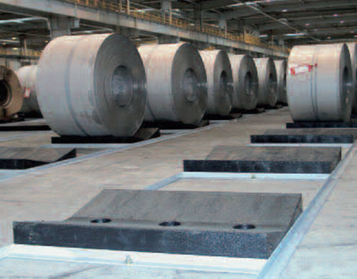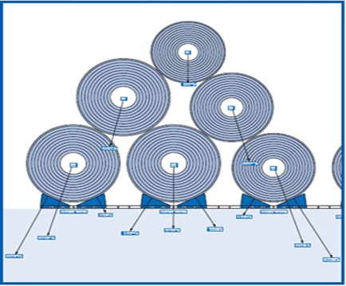

Figure 34 : Photos illustratives des SKID proposées

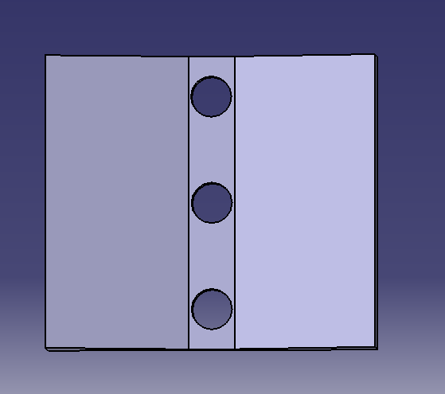 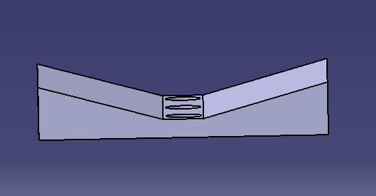

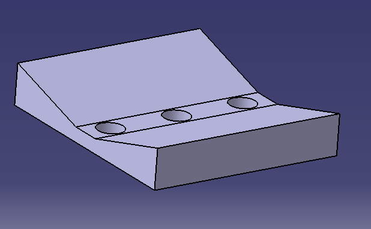

Figure 35 : Illustrations du dimensionnement des SKIDS

##### Objectifs :

Stockage des bobines lac à trois niveaux afin d’augmenter la capacité de stockage et permettre la production en masse.

##### Avantages :

Améliorer la sécurité du personnel.

Grande capacité de charge.

Moins de dommage des bobines.

Plus de traçabilité sur l’emplacement des bobines.

Possibilité de stockage à trois niveaux.

Résistance aux changements climatiques.

##### Contraintes :

La variété du diamètre des bobines.

#### Marquage des emplacements de stockage des bobines.

##### Contexte :

Au niveau du stock BS03, les bobines sont stockées selon des lignes numérotées de 1 à 4. Chaque ligne dispose d’un nombre d’emplacement ou position suivant la capacité de la zone.

On a proposé de faire un marquage au sol pour la numérotation des lignes, positions et niveaux. Ainsi que des flèches indiquant le sens du flux des engins et les pistes de déplacement autorisées. Trois catégories de marquage sont proposées :

- Numérotation des lignes sur les squids de stockages et codification des lignes à travers un code à barres spécifique à chaque ligne.

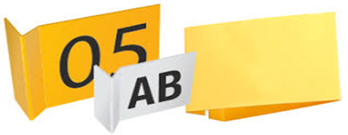

Figure 36 : Numérotation des lignes

- Numérotation des positions sur chaque ligne, et traçage des numéros des positions par gravure sur les côtés des SKID mis en place.

> 

Figure 37 : Numérotation des positions

- Marquage au sol des trajets des engins

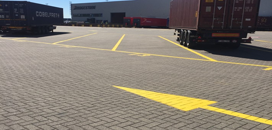

Figure 38 : Trajet des engins

##### Objectifs :

Diminuer le taux d’occupation des engins.

Augmenter le taux de disponibilité des engins ainsi que celui de l’opérateur.

Améliorer l’opération de l’inventaire.

##### Avantages :

Identification facile et exacte des emplacements exacts des bobines par le chauffeur de l’engin d’évacuation.

Organisation des déplacements de tous types d’engins dans la zone de stockage.

##### Contraintes :

Changements climatiques.

Dégradation de l’état du sol.

### Plan de zonage

Parmi les problèmes qu’on a détectés au niveau du stock BS03 le taux d’accomplissement du programme journalier de déplacement qui n’est pas satisfait et qui n’est pas maitrisé de telle sorte que chaque journée se caractérise par un taux d’accomplissement différent.

Notre analyse a abouti à une solution qui se base sur la suppression de l’ancien plan de zonage et l’instauration d’un nouveau qui a un temps cycle global inférieur et par la suite assurer un taux d’accomplissement performant.

Dans ce qui suit, on présentera l’ancien plan de zonage et le temps cycle global associé, et on le comparera avec le nouveau plan de zonage.

Le tableau ci-dessous est composé du plan de zonage dans lequel est mentionné les références et les zones dans lesquelles sont stockés

On associera à chaque zone le poids total des bobines mouvementé durant les 6 derniers mois (à partir de la base de données fournie par le département SI)

Le poids total est converti en nombre de bobines mouvementé durant les 6 derniers mois, en admettant que chaque bobine mesure 20 tonnes, en divisant le poids total par 20.

En plus du poids total, on va associer à chaque zone son temps cycle de déplacement qu’on a chronométré.

Après on multiplie le nombre de bobines par le temps cycle de chaque zone pour obtenir le total des temps cycle de chaque zone durant la période qu’on a fixé (6mois)

La somme des totaux des temps cycle nous donne on fin le temps cycle global de chaque plan de zonage.

| **Destination**                                             | **Epaisseur (en mm)** |       | **Largeur (en mm)** |       | **Zone** | **Poids total (en KG)** | **Nombre de bobines** | **Temps cycle (en secondes)** | **∑Temps cycle (en secondes)** | **Temps cycle global (en seconde)** | **Temps cycle global (en jours)** |
|-------------------------------------------------------------|-----------------------|-------|---------------------|-------|----------|-------------------------|-----------------------|-------------------------------|--------------------------------|-------------------------------------|-----------------------------------|
| ** **                                                       | **De**                | **A** | **De**              | **A** | ** **    | ** **                   | ** **                 | ** **                         | ** **                          | ** **                               | ** **                             |
| Bobines client                                              | \_                    | \_    | 1500                |       | S        | 17896270                | 895                   | 150                           | 134222                         | 4401099                             | 51                                |
| Bobine client strie / larme                                 | \_                    | \_    | 990                 | 1500  | A        | 19388254,5              | 969                   | 144                           | 139595                         |                                     |                                   |
| Bobine client                                               | \_                    | \_    | 1250                | 1290  | B        | 35448430                | 1772                  | 130                           | 230415                         |                                     |                                   |
| Bobine client                                               | \_                    | \_    | 1000                | 1040  | C        | 16149940                | 807                   | 155                           | 125162                         |                                     |                                   |
| Bobine client strie / larme                                 | \_                    | \_    | 990                 | 1500  | D        | 19388254,5              | 969                   | 122                           | 118268                         |                                     |                                   |
| Bobines Réparées RF1 & RF7 poids≤ 12T                       | \_                    | \_    | 990                 | 1270  | E        | 71492810                | 3575                  | 136                           | 486151                         |                                     |                                   |
| Transfert & Stock                                           | 2,7                   | 2,7   | 1000                | 1040  | F        | 3671550                 | 184                   | 91                            | 16706                          |                                     |                                   |
|                                                             | 2,8                   | 2,8   | 1000                | 1040  | F        | 457030                  | 23                    | 91                            | 2079                           |                                     |                                   |
|                                                             | 3                     | 3     | 1000                | 1040  | F        | 3992660                 | 200                   | 91                            | 18167                          |                                     |                                   |
|                                                             | 3,4                   | 3,4   | 1000                | 1040  | F        | 2978200                 | 149                   | 91                            | 13551                          |                                     |                                   |
|                                                             | 3,6                   | 3,8   | 1000                | 1040  | F        | 1198020                 | 60                    | 91                            | 5451                           |                                     |                                   |
| bobines reservées à Renault                                 | \_                    | \_    | 1040                | 1100  | I        | 1865530                 | 93                    | 130                           | 12126                          |                                     |                                   |
| bobines reservées au transfert                              | \_                    | \_    | 1040                | 1275  | I        | 88038398                | 4402                  | 130                           | 572250                         |                                     |                                   |
| Transfert & stock                                           | 2,7                   | 2,7   | 1250                | 1290  | G        | 11364940                | 568                   | 91                            | 51710                          |                                     |                                   |
|                                                             | 2,8                   | 2,8   | 1250                | 1290  | G        | 281720                  | 14                    | 91                            | 1282                           |                                     |                                   |
|                                                             | 3                     | 3     | 1250                | 1290  | G        | 9010680                 | 451                   | 91                            | 40999                          |                                     |                                   |
|                                                             | 3,4                   | 3,4   | 1250                | 1290  | G        | 7960150                 | 398                   | 91                            | 36219                          |                                     |                                   |
|                                                             | 3,6                   | 3,6   | 1250                | 1290  | G        | 2151840                 | 108                   | 91                            | 9791                           |                                     |                                   |
| Bobines Réparées RF1 & RF7 poids\>12T                       | \_                    | \_    | 1500                |       | H        | 24190090                | 1210                  | 111                           | 134255                         |                                     |                                   |
| Fine épaisseur client                                       | 1,6                   | 2,4   | 1000                | 1500  | J        | 13581249                | 679                   | 166                           | 112724                         |                                     |                                   |
| Fine épaisseur tranfert & stock                             | 1,6                   | 2,4   | 1000                | 1290  | K        | 33072434                | 1654                  | 155                           | 256311                         |                                     |                                   |
| Fine épaisseur tranfert & stock                             | 1,6                   | 2,4   | 1000                | 1290  | R        | 33072434                | 1654                  | 229                           | 378679                         |                                     |                                   |
| Bobine déformée UP COILER évacuées par le chariot élévateur | \_                    | \_    | \_                  | \_    | L        |                         |                       |                               | 0                              |                                     |                                   |
| Bobines Réparées RF1 & RF7 poids≤ 12T                       | \_                    | \_    | 1500                | 1500  | M        | 24190090                | 1210                  | 145                           | 175378                         |                                     |                                   |
| Stock                                                       | \_                    | \_    | 1490                | 1510  | N        | 331560                  | 17                    | 159                           | 2636                           |                                     |                                   |
| Bobines Réparées RF1 & RF7 poids≤ 12T                       | \_                    | \_    | 1000                | 1290  | O        | 84287520                | 4214                  | 186                           | 783874                         |                                     |                                   |
| Bobines Réparées RF1 & RF7 poids\>12T                       | \_                    | \_    | 1100                | 1290  | P        | 61112260                | 3056                  | 176                           | 537788                         |                                     |                                   |
| Bobines Réparées RF1 & RF7 poids\>12T                       | \_                    | \_    | 980                 | 1090  | Q        | 500890                  | 25                    | 212                           | 5309                           |                                     |                                   |
| Bobines NC                                                  | BS04                  |       |                     |       |          |                         |                       |                               |                                |                                     |                                   |

Tableau 24 : ancien plan de zonage muni des calculs

<table>
<colgroup>
<col style="width: 8%" />
<col style="width: 7%" />
<col style="width: 7%" />
<col style="width: 7%" />
<col style="width: 12%" />
<col style="width: 7%" />
<col style="width: 7%" />
<col style="width: 7%" />
<col style="width: 7%" />
<col style="width: 13%" />
<col style="width: 13%" />
</colgroup>
<thead>
<tr class="header">
<th></th>
<th></th>
<th></th>
<th></th>
<th></th>
<th></th>
<th></th>
<th></th>
<th></th>
<th><strong>Temps de déplacement</strong></th>
<th><strong>Temps de déplacement</strong></th>
</tr>
</thead>
<tbody>
<tr class="odd">
<td><strong>Destination</strong></td>
<td><strong>Epaisseur (en mm)</strong></td>
<td><strong>Largeur (en mm)</strong></td>
<td><strong>Zone</strong></td>
<td><strong>Ligne N/LIGNE N+1 
et 
Position</strong></td>
<td><strong>Poids total (en KG)</strong></td>
<td><strong>Nombre de bobines</strong></td>
<td><strong>Temps cycle moyen (en secondes)</strong></td>
<td><strong>∑Temps cycle (en secondes)</strong></td>
<td><strong>Temps cycle global (en secondes)</strong></td>
<td><strong>Temps cycle global (en jours)</strong></td>
</tr>
<tr class="even">
<td rowspan="5">Transfert A</td>
<td>2.20</td>
<td>_</td>
<td>G1+F1+H1</td>
<td>H: 1/2/3/4 (1==&gt;34) 
F: 1/2/3/4 (1==&gt; 27) 
G: 1/2/3/4 (1==&gt; 27)</td>
<td>27973238</td>
<td>1399</td>
<td>93</td>
<td>130076</td>
<td>2447993</td>
<td>28</td>
</tr>
<tr class="odd">
<td>2.00</td>
<td>_</td>
<td>E1</td>
<td>E : 1/2/3/4 (1==&gt;55)</td>
<td>20861810</td>
<td>1043</td>
<td>110</td>
<td>114740</td>
<td> </td>
<td> </td>
</tr>
<tr class="even">
<td>2.70</td>
<td>_</td>
<td>G2+F2</td>
<td>G: 1/2/3/4 (28==&gt;55) 
F: 1/2/3/4 (28==&gt;55)</td>
<td>17217280</td>
<td>861</td>
<td>96</td>
<td>82643</td>
<td> </td>
<td> </td>
</tr>
<tr class="odd">
<td>2.40</td>
<td>_</td>
<td>I1+I2</td>
<td>I : 1/2/3/4 (1==&gt;50)</td>
<td>16789540</td>
<td>839</td>
<td>130</td>
<td>109132</td>
<td> </td>
<td> </td>
</tr>
<tr class="even">
<td>3.00</td>
<td>_</td>
<td>H2</td>
<td>H: 1/2/3/4 (35==&gt;69)</td>
<td>13766600</td>
<td>688</td>
<td>116</td>
<td>79846</td>
<td> </td>
<td> </td>
</tr>
<tr class="odd">
<td rowspan="19">Cons A</td>
<td>3.00</td>
<td>_</td>
<td>D</td>
<td>D: 1/2</td>
<td>13241340</td>
<td>662</td>
<td>122</td>
<td>80772</td>
<td> </td>
<td> </td>
</tr>
<tr class="even">
<td>3.40</td>
<td>_</td>
<td rowspan="2">E2</td>
<td>E : 1/2/3/4 (56==&gt;86)</td>
<td>10418090</td>
<td>521</td>
<td>162</td>
<td>84387</td>
<td> </td>
<td> </td>
</tr>
<tr class="odd">
<td>2.00</td>
<td>_</td>
<td>E : 1/2/3/4 (87==&gt;110)</td>
<td>10056500</td>
<td>503</td>
<td>162</td>
<td>81458</td>
<td> </td>
<td> </td>
</tr>
<tr class="even">
<td>2.40</td>
<td>_</td>
<td rowspan="2">M</td>
<td>M : 1/2/3/4 (1==&gt;20)</td>
<td>6596880</td>
<td>330</td>
<td>145</td>
<td>47827</td>
<td> </td>
<td> </td>
</tr>
<tr class="odd">
<td>2.20</td>
<td>_</td>
<td>M : 1/2/3/4 (21==&gt;38)</td>
<td>6014870</td>
<td>301</td>
<td>145</td>
<td>43608</td>
<td> </td>
<td> </td>
</tr>
<tr class="even">
<td>3.80</td>
<td>_</td>
<td>J1</td>
<td>J : 1/2/3/4 (1==&gt;15)</td>
<td>5146180</td>
<td>257</td>
<td>162</td>
<td>41684</td>
<td> </td>
<td> </td>
</tr>
<tr class="odd">
<td>2.70</td>
<td>_</td>
<td>K1</td>
<td>K: 1/2/3/4 (1==&gt;15)</td>
<td>4851310</td>
<td>243</td>
<td>150</td>
<td>36385</td>
<td> </td>
<td> </td>
</tr>
<tr class="even">
<td>4.00</td>
<td>_</td>
<td rowspan="3">N1</td>
<td>N: 1/2/3/4 (1==&gt;15)</td>
<td>4835220</td>
<td>242</td>
<td>148</td>
<td>35781</td>
<td> </td>
<td> </td>
</tr>
<tr class="odd">
<td>6.00</td>
<td>_</td>
<td>N: 1/2/3/4 (16==&gt;27)</td>
<td>3946720</td>
<td>197</td>
<td>148</td>
<td>29206</td>
<td> </td>
<td> </td>
</tr>
<tr class="even">
<td>5.00</td>
<td>_</td>
<td>N: 1/2/3/4 (28==&gt;38)</td>
<td>3740430</td>
<td>187</td>
<td>148</td>
<td>27679</td>
<td> </td>
<td> </td>
</tr>
<tr class="odd">
<td>1.80</td>
<td>_</td>
<td rowspan="4">C</td>
<td>C: 1/2 (1==&gt;20)</td>
<td>3360160</td>
<td>168</td>
<td>155</td>
<td>26041</td>
<td> </td>
<td> </td>
</tr>
<tr class="even">
<td>2.50</td>
<td>_</td>
<td>C: 1/2 (21==&gt;40)</td>
<td>3118470</td>
<td>156</td>
<td>155</td>
<td>24168</td>
<td> </td>
<td> </td>
</tr>
<tr class="odd">
<td>2.80</td>
<td>_</td>
<td>C: 1/2 (41==&gt;58)</td>
<td>3087550</td>
<td>154</td>
<td>155</td>
<td>23929</td>
<td> </td>
<td> </td>
</tr>
<tr class="even">
<td>2.85</td>
<td>_</td>
<td>C: 1/2 (59==&gt;72)</td>
<td>3039530</td>
<td>152</td>
<td>155</td>
<td>23556</td>
<td> </td>
<td> </td>
</tr>
<tr class="odd">
<td>3.60</td>
<td>_</td>
<td rowspan="5">N2</td>
<td>N: 1/2/3/4 (39==&gt;18)</td>
<td>2911610</td>
<td>146</td>
<td>170</td>
<td>24749</td>
<td> </td>
<td> </td>
</tr>
<tr class="even">
<td>1.90</td>
<td>_</td>
<td>N: 1/2/3/4 (48==&gt;56)</td>
<td>2814710</td>
<td>141</td>
<td>170</td>
<td>23925</td>
<td> </td>
<td> </td>
</tr>
<tr class="odd">
<td>2.75</td>
<td>_</td>
<td>N: 1/2/3/4 (57==&gt;64)</td>
<td>2729960</td>
<td>136</td>
<td>170</td>
<td>23205</td>
<td> </td>
<td> </td>
</tr>
<tr class="even">
<td>4.60</td>
<td>_</td>
<td>N: 1/2/3/4 (65==&gt;70)</td>
<td>2025260</td>
<td>101</td>
<td>170</td>
<td>17215</td>
<td> </td>
<td> </td>
</tr>
<tr class="odd">
<td>3.65</td>
<td>_</td>
<td>N: 1/2/3/4 (71==&gt;75)</td>
<td>1630160</td>
<td>82</td>
<td>170</td>
<td>13856</td>
<td> </td>
<td> </td>
</tr>
<tr class="even">
<td rowspan="17">Locale A</td>
<td>3.80</td>
<td>_</td>
<td>J2</td>
<td>J: 1/2/3/4 (16==&gt;30)</td>
<td>6318490</td>
<td>316</td>
<td>170</td>
<td>53707</td>
<td> </td>
<td> </td>
</tr>
<tr class="odd">
<td>2.80</td>
<td>_</td>
<td rowspan="4">O1</td>
<td>O: 1/2/3/4 (1==&gt;15)</td>
<td>4888070</td>
<td>244</td>
<td>175</td>
<td>42771</td>
<td> </td>
<td> </td>
</tr>
<tr class="even">
<td>3.00</td>
<td>_</td>
<td>O: 1/2/3/4 (16==&gt;26)</td>
<td>3575010</td>
<td>179</td>
<td>175</td>
<td>31281</td>
<td> </td>
<td> </td>
</tr>
<tr class="odd">
<td>2.40</td>
<td>_</td>
<td>O: 1/2/3/4 (27==&gt;36)</td>
<td>3487590</td>
<td>174</td>
<td>175</td>
<td>30516</td>
<td> </td>
<td> </td>
</tr>
<tr class="even">
<td>2.85</td>
<td>_</td>
<td>O: 1/2/3/4 (37==&gt;45)</td>
<td>3084670</td>
<td>154</td>
<td>175</td>
<td>26991</td>
<td> </td>
<td> </td>
</tr>
<tr class="odd">
<td>1.90</td>
<td>_</td>
<td rowspan="2">K2</td>
<td>K: 1/2/3/4 (16==&gt;23)</td>
<td>2772850</td>
<td>139</td>
<td>160</td>
<td>22183</td>
<td> </td>
<td> </td>
</tr>
<tr class="even">
<td>6.00</td>
<td>_</td>
<td>K: 1/2/3/4 (24==&gt;30)</td>
<td>2766410</td>
<td>138</td>
<td>160</td>
<td>22131</td>
<td> </td>
<td> </td>
</tr>
<tr class="odd">
<td>2.70</td>
<td>_</td>
<td rowspan="4">B</td>
<td>B: 1/2 (1==&gt;16)</td>
<td>2756590</td>
<td>138</td>
<td>130</td>
<td>17918</td>
<td> </td>
<td> </td>
</tr>
<tr class="even">
<td>2.00</td>
<td>_</td>
<td>B: 1/2 (17==&gt;32)</td>
<td>2731380</td>
<td>137</td>
<td>130</td>
<td>17754</td>
<td> </td>
<td> </td>
</tr>
<tr class="odd">
<td>5.00</td>
<td>_</td>
<td>B: 1/2 (33==&gt;46)</td>
<td>2359680</td>
<td>118</td>
<td>130</td>
<td>15338</td>
<td> </td>
<td> </td>
</tr>
<tr class="even">
<td>1.80</td>
<td>_</td>
<td>B: 1/2 (47==&gt;59)</td>
<td>2228190</td>
<td>111</td>
<td>130</td>
<td>14483</td>
<td> </td>
<td> </td>
</tr>
<tr class="odd">
<td>4.80</td>
<td>_</td>
<td rowspan="6">S+A</td>
<td>A: 1/2 (1==&gt;13)</td>
<td>2173170</td>
<td>109</td>
<td>147</td>
<td>15973</td>
<td> </td>
<td> </td>
</tr>
<tr class="even">
<td>4.00</td>
<td>_</td>
<td>A: 1/2 (14==&gt;25)</td>
<td>2072830</td>
<td>104</td>
<td>147</td>
<td>15235</td>
<td> </td>
<td> </td>
</tr>
<tr class="odd">
<td>2.20</td>
<td>_</td>
<td>A: 1/2 (26==&gt;27) 
S: 1 (1==&gt;14)</td>
<td>1891530</td>
<td>95</td>
<td>147</td>
<td>13903</td>
<td> </td>
<td> </td>
</tr>
<tr class="even">
<td>10.00</td>
<td>_</td>
<td>S: 1 (15==&gt;30)</td>
<td>1414550</td>
<td>71</td>
<td>147</td>
<td>10397</td>
<td> </td>
<td> </td>
</tr>
<tr class="odd">
<td>8.00</td>
<td>_</td>
<td>S: 1 (31==&gt;46)</td>
<td>1392470</td>
<td>70</td>
<td>147</td>
<td>10235</td>
<td> </td>
<td> </td>
</tr>
<tr class="even">
<td>3.50</td>
<td>_</td>
<td>S: 1 (47==&gt;52)</td>
<td>1082820</td>
<td>54</td>
<td>147</td>
<td>7959</td>
<td> </td>
<td> </td>
</tr>
<tr class="odd">
<td rowspan="22">Export A</td>
<td>4.00</td>
<td>_</td>
<td rowspan="7">P1</td>
<td>P: 1/2/3/4 (1==&gt;8)</td>
<td>2584530</td>
<td>129</td>
<td>150</td>
<td>19384</td>
<td> </td>
<td> </td>
</tr>
<tr class="even">
<td>2.00</td>
<td>_</td>
<td>P: 1/2/3/4 (9==&gt;15)</td>
<td>2305860</td>
<td>115</td>
<td>150</td>
<td>17294</td>
<td> </td>
<td> </td>
</tr>
<tr class="odd">
<td>3.00</td>
<td>_</td>
<td>P: 1/2/3/4 (16==&gt;22)</td>
<td>2257600</td>
<td>113</td>
<td>150</td>
<td>16932</td>
<td> </td>
<td> </td>
</tr>
<tr class="even">
<td>2.75</td>
<td>_</td>
<td>P: 1/2/3/4 (23==&gt;28)</td>
<td>2103620</td>
<td>105</td>
<td>150</td>
<td>15777</td>
<td> </td>
<td> </td>
</tr>
<tr class="odd">
<td>4.60</td>
<td>_</td>
<td>P: 1/2/3/4 (29==&gt;34)</td>
<td>1961700</td>
<td>98</td>
<td>150</td>
<td>14713</td>
<td> </td>
<td> </td>
</tr>
<tr class="even">
<td>3.65</td>
<td>_</td>
<td>P: 1/2/3/4 (35==&gt;39)</td>
<td>1692730</td>
<td>85</td>
<td>150</td>
<td>12695</td>
<td> </td>
<td> </td>
</tr>
<tr class="odd">
<td>5.00</td>
<td>_</td>
<td>P: 1/2/3/4 (40==&gt;43)</td>
<td>1445560</td>
<td>72</td>
<td>150</td>
<td>10842</td>
<td> </td>
<td> </td>
</tr>
<tr class="even">
<td>2.50</td>
<td>_</td>
<td rowspan="6">T</td>
<td>T: 1 (1==&gt;17)</td>
<td>1441660</td>
<td>72</td>
<td>169</td>
<td>12182</td>
<td> </td>
<td> </td>
</tr>
<tr class="odd">
<td>1.80</td>
<td>_</td>
<td>T: 1 (18==&gt;33)</td>
<td>1304270</td>
<td>65</td>
<td>169</td>
<td>11021</td>
<td> </td>
<td> </td>
</tr>
<tr class="even">
<td>7.40</td>
<td>_</td>
<td>T: 1 (34==&gt;46)</td>
<td>1069310</td>
<td>53</td>
<td>169</td>
<td>9036</td>
<td> </td>
<td> </td>
</tr>
<tr class="odd">
<td>5.45</td>
<td>_</td>
<td>T: 1 (47==&gt;57)</td>
<td>958940</td>
<td>48</td>
<td>169</td>
<td>8103</td>
<td> </td>
<td> </td>
</tr>
<tr class="even">
<td>2.72</td>
<td>_</td>
<td>T: 1 (58==&gt;66)</td>
<td>787840</td>
<td>39</td>
<td>169</td>
<td>6657</td>
<td> </td>
<td> </td>
</tr>
<tr class="odd">
<td>6.00</td>
<td>_</td>
<td>T: 1 (67==&gt;70)</td>
<td>748270</td>
<td>37</td>
<td>169</td>
<td>6323</td>
<td> </td>
<td> </td>
</tr>
<tr class="even">
<td>2.20</td>
<td>_</td>
<td rowspan="9">Q1</td>
<td>Q: 1/2/3/4 (1==&gt;2)</td>
<td>702500</td>
<td>35</td>
<td>190</td>
<td>6674</td>
<td> </td>
<td> </td>
</tr>
<tr class="odd">
<td>4.45</td>
<td>_</td>
<td>Q: 1/2/3/4 (3==&gt;4)</td>
<td>696600</td>
<td>35</td>
<td>190</td>
<td>6618</td>
<td> </td>
<td> </td>
</tr>
<tr class="even">
<td>8.00</td>
<td>_</td>
<td>Q: 1/2/3/4 (5==&gt;6)</td>
<td>681280</td>
<td>34</td>
<td>190</td>
<td>6472</td>
<td> </td>
<td> </td>
</tr>
<tr class="odd">
<td>2.80</td>
<td>_</td>
<td>Q: 1/2/3/4 (7==&gt;8)</td>
<td>674270</td>
<td>34</td>
<td>190</td>
<td>6406</td>
<td> </td>
<td> </td>
</tr>
<tr class="even">
<td>5.60</td>
<td>_</td>
<td>Q: 1/2/3/4 (9==&gt;10)</td>
<td>663410</td>
<td>33</td>
<td>190</td>
<td>6302</td>
<td> </td>
<td> </td>
</tr>
<tr class="odd">
<td>2.40</td>
<td>_</td>
<td>Q: 1/2/3/4 (11==&gt;12)</td>
<td>656320</td>
<td>33</td>
<td>190</td>
<td>6235</td>
<td> </td>
<td> </td>
</tr>
<tr class="even">
<td>15.50</td>
<td>_</td>
<td>Q: 1/2/3/4 (13==&gt;14)</td>
<td>575880</td>
<td>29</td>
<td>190</td>
<td>5471</td>
<td> </td>
<td> </td>
</tr>
<tr class="odd">
<td>2.70</td>
<td>_</td>
<td>Q: 1/2/3/4 (15==&gt;16)</td>
<td>537150</td>
<td>27</td>
<td>190</td>
<td>5103</td>
<td> </td>
<td> </td>
</tr>
<tr class="even">
<td>10.00</td>
<td>_</td>
<td>Q: 1/2/3/4 (17==&gt;18)</td>
<td>529080</td>
<td>26</td>
<td>190</td>
<td>5026</td>
<td> </td>
<td> </td>
</tr>
<tr class="odd">
<td rowspan="2">Transfert B</td>
<td>3.40</td>
<td>_</td>
<td rowspan="2">O2</td>
<td>O: 1/2/3/4 (46==&gt; 79)</td>
<td>11384470</td>
<td>569</td>
<td>186</td>
<td>105876</td>
<td> </td>
<td> </td>
</tr>
<tr class="even">
<td>3.60</td>
<td>_</td>
<td>O: 1/2/3/4 (80==&gt; 90)</td>
<td>3636340</td>
<td>182</td>
<td>186</td>
<td>33818</td>
<td> </td>
<td> </td>
</tr>
<tr class="odd">
<td>Cons B</td>
<td>_</td>
<td>_</td>
<td>P2</td>
<td>P: 1/2/3/4 (44==&gt;86)</td>
<td>15417870</td>
<td>771</td>
<td>202</td>
<td>155720</td>
<td> </td>
<td> </td>
</tr>
<tr class="even">
<td>Transfert C</td>
<td>_</td>
<td>_</td>
<td>R1</td>
<td>R: 1/2/3/4 (1==&gt;20)</td>
<td>6807310</td>
<td>340</td>
<td>203</td>
<td>69094</td>
<td> </td>
<td> </td>
</tr>
<tr class="odd">
<td>Cons C</td>
<td>_</td>
<td>_</td>
<td>Q2</td>
<td>Q: 1/2/3/4 (22==&gt;40)</td>
<td>5960390</td>
<td>298</td>
<td>234</td>
<td>69737</td>
<td> </td>
<td> </td>
</tr>
<tr class="even">
<td>Locale B</td>
<td>_</td>
<td>_</td>
<td>R2</td>
<td>R: 1 (21==&gt;43)</td>
<td>7918539</td>
<td>396</td>
<td>255</td>
<td>100961</td>
<td> </td>
<td> </td>
</tr>
<tr class="odd">
<td>Locale C</td>
<td>_</td>
<td>_</td>
<td>Excès I2</td>
<td>I: 1/2/3/4 (51==&gt;59)</td>
<td>2897090</td>
<td>145</td>
<td>140</td>
<td>20280</td>
<td> </td>
<td> </td>
</tr>
<tr class="even">
<td>Export B</td>
<td>_</td>
<td>_</td>
<td>U</td>
<td>U: 1</td>
<td>4509642</td>
<td>225</td>
<td>250</td>
<td>56371</td>
<td> </td>
<td> </td>
</tr>
<tr class="odd">
<td>Export C</td>
<td>_</td>
<td>_</td>
<td>Excès Q1</td>
<td>Q: 1/2/3/4 (19==&gt;21)</td>
<td>1676510</td>
<td>84</td>
<td>190</td>
<td>15927</td>
<td> </td>
<td> </td>
</tr>
<tr class="even">
<td>Stock A</td>
<td>_</td>
<td>_</td>
<td rowspan="3">Excès P2</td>
<td rowspan="3">P : 1/2/3/4 (87==&gt;89)</td>
<td>818730</td>
<td>41</td>
<td>202</td>
<td>8269</td>
<td> </td>
<td> </td>
</tr>
<tr class="odd">
<td>Stock B</td>
<td>_</td>
<td>_</td>
<td>141990</td>
<td>7</td>
<td>202</td>
<td>1434</td>
<td> </td>
<td> </td>
</tr>
<tr class="even">
<td>Stock C</td>
<td>_</td>
<td>_</td>
<td>59370</td>
<td>3</td>
<td>202</td>
<td>600</td>
<td> </td>
<td> </td>
</tr>
<tr class="odd">
<td>Bobine déformée UP COILER évacuée par le chariot élévateur</td>
<td> </td>
<td> </td>
<td>L</td>
<td> </td>
<td> </td>
<td> </td>
<td> </td>
<td> </td>
<td> </td>
<td> </td>
</tr>
<tr class="even">
<td>Bobines NC</td>
<td colspan="10">BS04</td>
</tr>
</tbody>
</table>

Tableau 25 : nouveau plan de zonage muni des calculs

L’ancien plan de zonage montre que le temps cycle global du stock dans la période fixée est de **51 jours** en valeur, tandis que le nouveau plan de zonage montre un temps cycle global de **28 jours** en valeur dans la même période et avec les mêmes données utilisées dans le calcul de l’ancien temps cycle global.

En conclusion, à travers cette étude j’ai économisé 23 jours de déplacement dans 6 mois que je quantifierai en termes de gain dans la partie contrôle de la démarche.

Ce nouveau plan de zonage est visualisé sur la cartographie suivante :

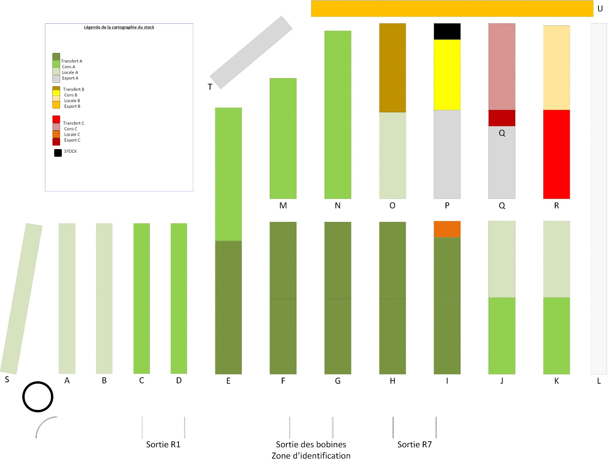

Figure 42 : Nouvelle cartographie du stock BS03

## Contrôler

Après la mise en place du projet, la phase contrôler reste une phase primordiale pour veiller sur la bonne application des améliorations, la standardisation des actions menées, chiffrer les gains obtenus et garantir la pérennité des résultats.

Pour assurer ces points-là, j’ai mis en place un système de gestion de stock composé d’un livret des procédures qui gère toutes les actions au niveau du stock de la sortie de la bobine de la machine Steckel Mill jusqu’à sa livraison vers le client final. Ce livret est accompagné d’un livret de consignes pour verrouiller toute action aléatoire de la part d’un opérateur.

Ensuite j’ai mis en place un tableau de bord interactif contenant quatre indicateurs de performances significatifs au niveau du périmètre du projet.

Et je clôturerai cette phase par l’impact que ce projet aura en chiffre.

### Livret des procédures

Ce livret contient huit procédures pour la gestion de stock :

#### Entrée en stock bobine

<table>
<colgroup>
<col style="width: 24%" />
<col style="width: 75%" />
</colgroup>
<thead>
<tr class="header">
<th><strong>Pilote processus</strong></th>
<th><ul>
<li>
Responsable Stock
</li>
</ul></th>
</tr>
</thead>
<tbody>
<tr class="odd">
<td><strong>Éléments déclencheurs</strong></td>
<td><ul>
<li>
Production de la bobine
</li>
</ul></td>
</tr>
<tr class="even">
<td><strong>Règles de gestion</strong></td>
<td><ol type="1">
<li><blockquote>

Directement après la sortie de la bobine de la machine Steckel, un contrôle qualité est effectué à chaud.

</blockquote></li>
<li><blockquote>

Les bobines Cobbles sont évacuées à l’extérieur après la sortie de la machine Steckel.

</blockquote></li>
<li><blockquote>

Les bobines conformes sont déplacées vers la zone de refroidissement par pont roulant pour une durée de 48h avant de les déplacer vers la zone d’identification dans laquelle un contrôle dimensionnel et identification (des n° des lots) est effectué avant le collage des étiquettes

</blockquote></li>
<li><blockquote>

Les bobines sont déplacées vers la zone mentionnée dans le stock extérieur, le chauffeur du « clarque » effectue le zonage et l’adressage des lots

</blockquote></li>
</ol></td>
</tr>
<tr class="odd">
<td><strong>Points de contrôle</strong></td>
<td><ul>
<li>
Contrôle dimensionnel et d’identification
</li>
<li>
Vérification de la qualité des bobines à la sortie Steckel
</li>
</ul></td>
</tr>
<tr class="even">
<td><strong>Flux documentaire</strong></td>
<td>
Fiche d’inventaire.

Ordonnancement sortie bobine.

Rapport de production
</td>
</tr>
</tbody>
</table>

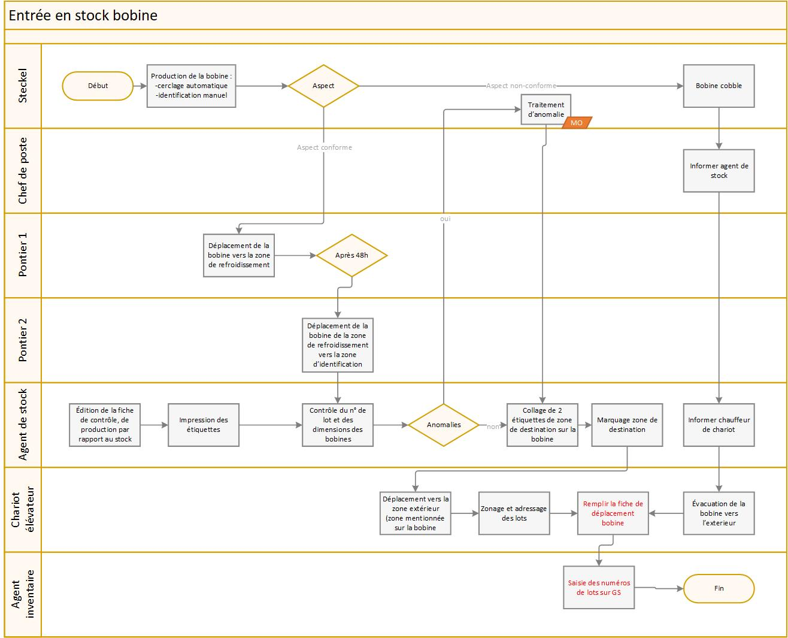

#### Alimentation/évacuation des machines de réparation

<table>
<colgroup>
<col style="width: 24%" />
<col style="width: 75%" />
</colgroup>
<thead>
<tr class="header">
<th><strong>Pilote processus</strong></th>
<th><ul>
<li>
Agent de stock
</li>
</ul></th>
</tr>
</thead>
<tbody>
<tr class="odd">
<td><strong>Éléments déclencheurs</strong></td>
<td><ul>
<li>
Fiche d’ordonnancement réparation
</li>
</ul></td>
</tr>
<tr class="even">
<td><strong>Règles de gestion</strong></td>
<td>
À la sortie de la machine Steckel, certaines bobines représentent des anomalies de forme (dimensions)

<ol type="1">
<li><blockquote>

Après refroidissement identification et stockage au niveau du stock extérieur, le service planification établit la fiche d’ordonnancement de réparation et l’envoie à l’agent de stock qui fait le marquage des lots à déplacer par le chauffeur du « clarque ». Les lots sont placés à l’entrée de la machine de réparation pour subir l’opération de « production »

</blockquote></li>
<li><blockquote>

Après subir les modifications mentionnées sur la fiche de réparation « MIC », la bobine est placée sur la sortie de la machine de réparation, étiquetée et contrôlée par le service contrôle qualité et le service stock. En fin l’agent de stock fait le marquage des destinations et le chauffeur du « clarque » déplace les bobines concernées.

</blockquote></li>
</ol></td>
</tr>
<tr class="odd">
<td><strong>Points de contrôle</strong></td>
<td><ul>
<li>
Contrôle qualitatif et d’identification de la bobine par l’agent de stock et par le contrôleur qualité
</li>
</ul></td>
</tr>
<tr class="even">
<td><strong>Flux documentaire</strong></td>
<td><ul>
<li>
Mode opératoire traitement des anomalies
</li>
<li>
Fiche d’ordonnancement
</li>
<li>
Fiche de stock digitale
</li>
</ul></td>
</tr>
</tbody>
</table>

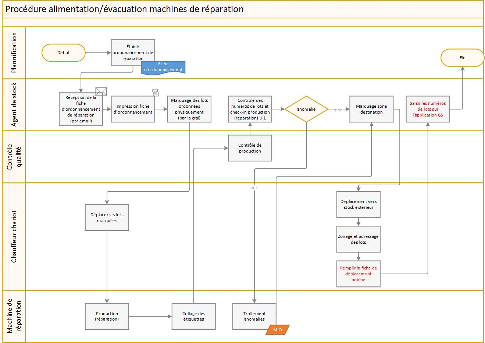

Figure 44 : Logigramme de la procédure alimentation/évacuation machines de réparation

#### Inventaire bobines

<table>
<colgroup>
<col style="width: 24%" />
<col style="width: 75%" />
</colgroup>
<thead>
<tr class="header">
<th><strong>Pilote processus</strong></th>
<th><ul>
<li>
Responsable Stock
</li>
</ul></th>
</tr>
</thead>
<tbody>
<tr class="odd">
<td><strong>Éléments déclencheurs</strong></td>
<td><ul>
<li>
Programme d’inventaire
</li>
</ul></td>
</tr>
<tr class="even">
<td><strong>Règles de gestion</strong></td>
<td><ol type="1">
<li><blockquote>

Le chef de poste fait la répartition des zones par agent

</blockquote></li>
<li><blockquote>

L’agent de stock affecté fait la saisie de l’inventaire par PDA et fait le traitement des anomalies sur système après sa détection automatique par le PDA.

</blockquote></li>
<li><blockquote>

Le responsable de stock élabore le PV de l’inventaire contenant les anomalies traitées

</blockquote></li>
</ol></td>
</tr>
<tr class="odd">
<td><strong>Flux documentaire</strong></td>
<td><ul>
<li><blockquote>

Programme d’inventaire

</blockquote></li>
<li><blockquote>

PV d’inventaire

</blockquote></li>
</ul></td>
</tr>
</tbody>
</table>

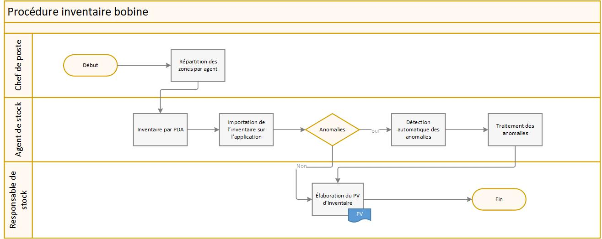

Figure 45 : Logigramme de la procédure inventaire bobines

#### Transfert bobine Lac

<table>
<colgroup>
<col style="width: 24%" />
<col style="width: 75%" />
</colgroup>
<thead>
<tr class="header">
<th><strong>Pilote processus</strong></th>
<th><ul>
<li>
Agent de stock
</li>
</ul></th>
</tr>
</thead>
<tbody>
<tr class="odd">
<td><strong>Éléments déclencheurs</strong></td>
<td><ul>
<li>
Bon de chargement transfert
</li>
</ul></td>
</tr>
<tr class="even">
<td><strong>Règles de gestion</strong></td>
<td><ol type="1">
<li><blockquote>

L’agent de stock communique le nombre de camions suivant le planning j-1 et marque les bobines à charger suivant la priorité

</blockquote></li>
<li><blockquote>

L’agent de livraison fait entrer les camions et les pèse à vide

</blockquote></li>
<li><blockquote>

L’agent de stock reçoit les camions et les oriente vers les points de livraisons

</blockquote></li>
<li><blockquote>

Le chariot élévateur charge les bobines sur les camions et l’agent de stock pointe les lots chargés sur le bon et vérifie le bon arrimage

</blockquote></li>
<li><blockquote>

À la sortie un deuxième pesage et un contrôle qualité sont effectués avant la génération du bon de livraison le départ du camion.

</blockquote></li>
</ol></td>
</tr>
<tr class="odd">
<td><strong>Points de contrôle</strong></td>
<td><ul>
<li>
Vérification de la qualité des bobines au niveau du pont-bascule
</li>
<li>
Vérification de la qualité des bobines avant chargement des camions
</li>
</ul></td>
</tr>
<tr class="even">
<td><strong>Flux documentaire</strong></td>
<td>
Planning de transfert J-1

Bon de chargement transfert

Bon de livraison transfert
</td>
</tr>
</tbody>
</table>

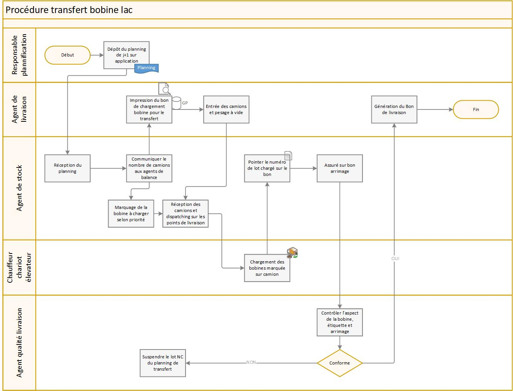

Figure 46 : Logigramme de la procédure transfert Bobine Lac

#### Livraison locale bobine lac

<table>
<colgroup>
<col style="width: 24%" />
<col style="width: 75%" />
</colgroup>
<thead>
<tr class="header">
<th><strong>Pilote processus</strong></th>
<th><ul>
<li>
Agent de stock
</li>
</ul></th>
</tr>
</thead>
<tbody>
<tr class="odd">
<td><strong>Éléments déclencheurs</strong></td>
<td><ul>
<li>
Bon de chargement
</li>
</ul></td>
</tr>
<tr class="even">
<td><strong>Règles de gestion</strong></td>
<td><ol type="1">
<li><blockquote>

L’agent de stock communique le nombre de camions suivant le planning j-1 et marque les bobines à charger suivant la priorité

</blockquote></li>
<li><blockquote>

L’agent de livraison fait entrer les camions et les pèse à vide

</blockquote></li>
<li><blockquote>

L’agent de stock reçoit les camions et les oriente vers les points de livraison et communique le nombre de bobines par camion

</blockquote></li>
<li><blockquote>

Le chariot élévateur charge les bobines sur les camions et l’agent de stock pointe les lots chargés sur le bon et vérifie le bon arrimage

</blockquote></li>
<li><blockquote>

À la sortie un deuxième pesage et un contrôle qualité sont effectués avant la génération du bon de livraison le départ du camion.

</blockquote></li>
</ol></td>
</tr>
<tr class="odd">
<td><strong>Points de contrôle</strong></td>
<td><ul>
<li>
Vérification de la qualité des bobines au niveau du pont-bascule
</li>
<li>
Vérification de la qualité des bobines avant chargement des camions
</li>
</ul></td>
</tr>
<tr class="even">
<td><strong>Flux documentaire</strong></td>
<td>
Planning de livraison J-1

Bon de chargement

Bon de livraison
</td>
</tr>
</tbody>
</table>

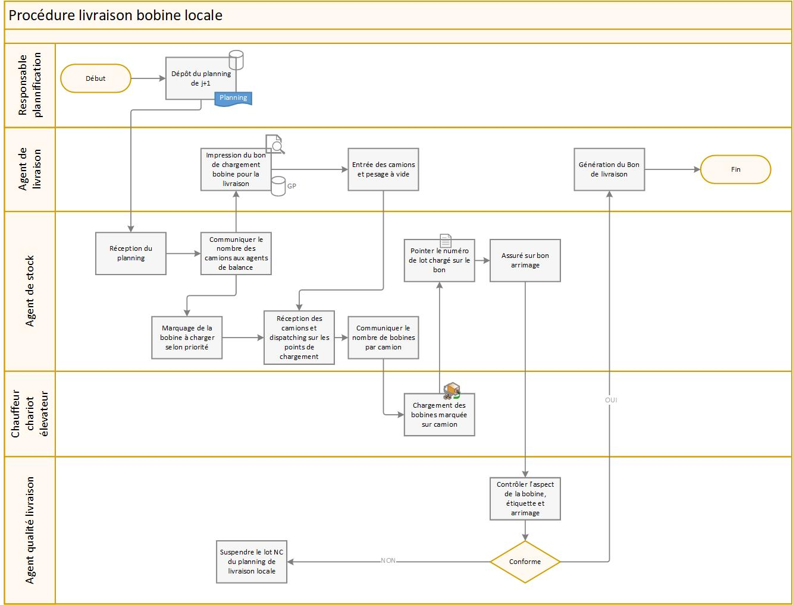

Figure 47 : Logigramme de la procédure Livraison locale bobine Lac

#### Export conventionnel

<table>
<colgroup>
<col style="width: 24%" />
<col style="width: 75%" />
</colgroup>
<thead>
<tr class="header">
<th><strong>Pilote processus</strong></th>
<th><ul>
<li>
Responsable Stock
</li>
</ul></th>
</tr>
</thead>
<tbody>
<tr class="odd">
<td><strong>Éléments déclencheurs</strong></td>
<td><ul>
<li>
Planning j-1
</li>
</ul></td>
</tr>
<tr class="even">
<td><strong>Règles de gestion</strong></td>
<td><ol type="1">
<li><blockquote>

Le responsable ADV envoie l’objectif export du mois.

</blockquote></li>
<li><blockquote>

Le service planification charge les listes et les valide sur l’application

</blockquote></li>
<li><blockquote>

Validation du service qualité de la conformité des bobines disponible

</blockquote></li>
<li><blockquote>

Le responsable stock associe l’ordre d’export et marque les bobines

</blockquote></li>
<li><blockquote>

Le responsable livraison fait entrer les camions vides et associe à chaque camion un bon de chargement

</blockquote></li>
<li><blockquote>

L’agent de stock charge les camions et remplit le bon de chargement

</blockquote></li>
<li><blockquote>

Après le chargement des camions, un contrôle qualité est effectué au niveau du pont-bascule avant l’édition du bon de livraison et l’expédition des commandes exportées.

</blockquote></li>
</ol></td>
</tr>
<tr class="odd">
<td><strong>Points de contrôle</strong></td>
<td><ul>
<li>
Validation des listes de chargement export
</li>
<li><blockquote>

Vérification de la qualité des bobines au pont-bascule lors de la sortie de livraison

</blockquote></li>
</ul></td>
</tr>
<tr class="even">
<td><strong>Flux documentaire</strong></td>
<td>
Liste de chargement export validé

Bon de chargement

Bon de livraison
</td>
</tr>
</tbody>
</table>

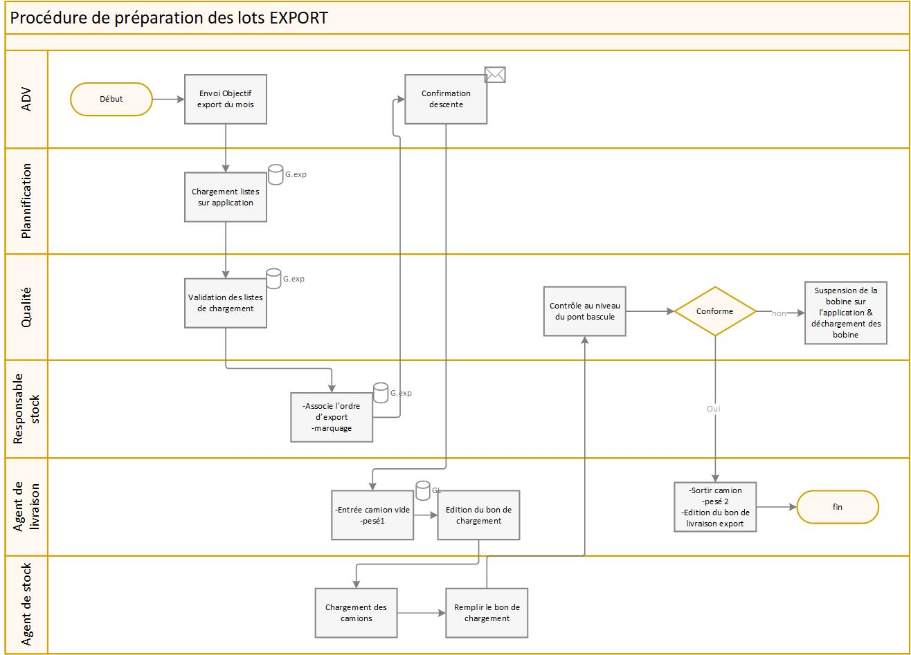

Figure 48 : Logigramme de la procédure export conventionnel

#### Préparation/expédition export conteneur

<table>
<colgroup>
<col style="width: 24%" />
<col style="width: 75%" />
</colgroup>
<thead>
<tr class="header">
<th><strong>Pilote processus</strong></th>
<th><ul>
<li>
Responsable Stock
</li>
</ul></th>
</tr>
</thead>
<tbody>
<tr class="odd">
<td><strong>Éléments déclencheurs</strong></td>
<td><ul>
<li>
Planning j-1
</li>
</ul></td>
</tr>
<tr class="even">
<td><strong>Règles de gestion</strong></td>
<td><ol type="1">
<li><blockquote>

Le responsable ADV envoie l’objectif export du mois

</blockquote></li>
<li><blockquote>

Le service planification charge et valide les listes sur l’application

</blockquote></li>
<li><blockquote>

Validation du service qualité de la conformité des bobines disponible

</blockquote></li>
<li><blockquote>

Le responsable stock associe l’ordre d’export et marque les bobines

</blockquote></li>
<li><blockquote>

Réception des conteneurs vide et préparation des commandes et saisie des lots chargés sur application

</blockquote></li>
<li><blockquote>

Le responsable livraison fait entrer les camions vides

</blockquote></li>
<li><blockquote>

L’agent de stock charge les camions et remplit le bon de chargement

</blockquote></li>
<li><blockquote>

Après le chargement des camions, édition du bon de livraison et l’expédition des commandes exportées.

</blockquote></li>
</ol></td>
</tr>
<tr class="odd">
<td><strong>Points de contrôle</strong></td>
<td><ul>
<li>
Validation des listes sur l’application
</li>
</ul></td>
</tr>
<tr class="even">
<td><strong>Flux documentaire</strong></td>
<td>
Liste chargement export validé

Bon de chargement

Bon de livraison
</td>
</tr>
</tbody>
</table>

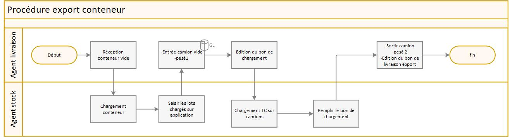

Figure 49 : logigramme de la procédure Export conteneur

#### Gestion des retours interne

<table>
<colgroup>
<col style="width: 24%" />
<col style="width: 75%" />
</colgroup>
<thead>
<tr class="header">
<th><strong>Pilote processus</strong></th>
<th><ul>
<li>
Responsable Stock
</li>
</ul></th>
</tr>
</thead>
<tbody>
<tr class="odd">
<td><strong>Éléments déclencheurs</strong></td>
<td><ul>
<li>
Retour bobine
</li>
</ul></td>
</tr>
<tr class="even">
<td><strong>Règles de gestion</strong></td>
<td><ol type="1">
<li><blockquote>

Le chauffeur du camion dépose le bon de retour livré par le client contenant les défauts détectés au niveau des bobines livrées

</blockquote></li>
<li><blockquote>

Le responsable balance alerte l’ADV du retour et identifie les types de défauts et saisit le retour sur l’application gestion des livraisons

</blockquote></li>
<li><blockquote>

Le chauffeur du camion déplace les bobines de retour vers la zone de retour et le chauffeur du « clarque » fait le zonage des lots de retour

</blockquote></li>
<li><blockquote>

L’agent de stock confirme la réception du retour et saisit les nouveaux emplacements

</blockquote></li>
</ol></td>
</tr>
<tr class="odd">
<td><strong>Points de contrôle</strong></td>
<td><ul>
<li>
Vérification du poids des bobines (input et output)
</li>
</ul></td>
</tr>
<tr class="even">
<td><strong>Flux documentaire</strong></td>
<td><ul>
<li><blockquote>

Bon de retour

</blockquote></li>
</ul></td>
</tr>
</tbody>
</table>

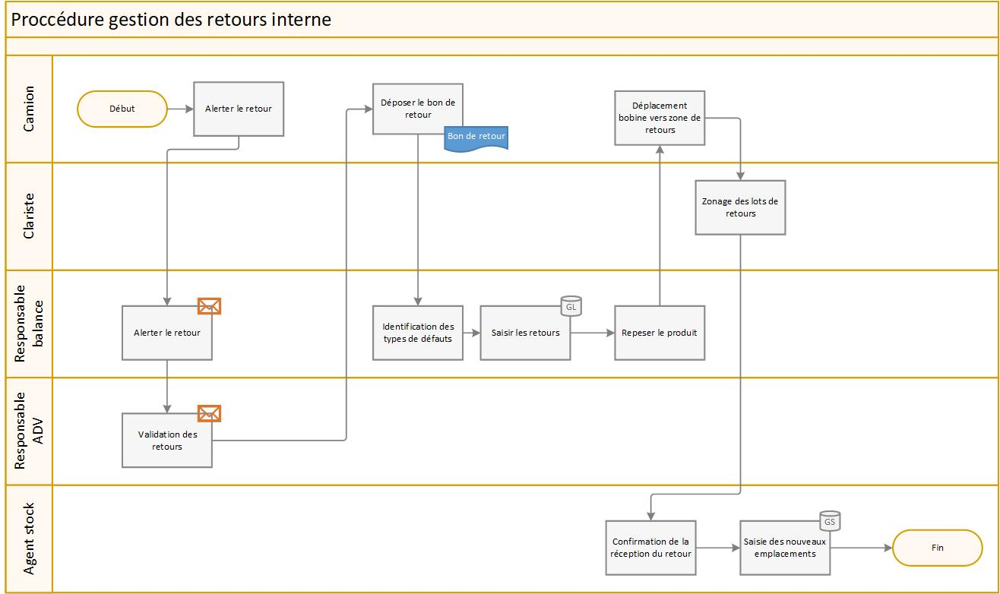

Figure 50: Logigramme de la procédure gestion des retours interne

### 

### Tableau de bord

Le tableau de bord est un élément très important pour le suivie de la performance et l’intervention en cas des fluctuations des indicateurs de performances au niveau d’un poste de travail.

Chaque département ou poste de travail demande une étude de cas pour savoir les indicateurs de performances adéquats pour la mesure de la performance de cette entité.

Cette phase vise aussi à établir les indicateurs permettant d’évaluer la performance du processus cible et par la suite l’efficacité des plans d’amélioration mis en œuvre.

Au niveau de la gestion du stock, il y a une absence d’un suivi du fonctionnement du système. Il n’existe aucun chiffre clé permettant de savoir l’état d’évolution et de performance du système de gestion du stock.

Tout d’abord, une fiche de suivi des indicateurs a été partagée avec les différents acteurs concernés sur Excel afin de pouvoir collecter les données pour la visualisation des KPI’S.

J’ai proposé d’importer la base de données en fichier Excel sur le logiciel Power BI afin de visualiser les différents indicateurs de performance sous forme d’un tableau de bord interactif.

L’étude du cas sur le périmètre du projet m’a conduit à établir un tableau de bord composé de quatre indicateurs de performances :

<table>
<colgroup>
<col style="width: 44%" />
<col style="width: 55%" />
</colgroup>
<thead>
<tr class="header">
<th>Indicateur</th>
<th>Formule</th>
</tr>
</thead>
<tbody>
<tr class="odd">
<td>Taux de réalisation</td>
<td>TR= nombre de chargements en retard/nombre total de chargements</td>
</tr>
<tr class="even">
<td>Taux de qualité à la livraison</td>
<td>TQ=nbre de bobine déclarée NC après planification/nbre total de bobines planifiées</td>
</tr>
<tr class="odd">
<td>Taux de qualité stock (mensuel)</td>
<td>TQ=nbre de bobines touchées par une anomalie après sa mise en stock / nbre total de bobines stockées</td>
</tr>
<tr class="even">
<td>Taux d’écart</td>
<td>
TE = Etat1 – Etat2

Etat1=Stock début mois +Production du mois

Etat2=Stock fin du mois + Sortie stock(transfert-local-export)
</td>
</tr>
</tbody>
</table>

Figure 52 : Les indicateurs de performance et leurs formules

Pour bien assimiler ces indicateurs de performances, je visualiserai le taux de réalisation des bobines à destination du transfert vers le site logistique.

| JOUR   | NBRE RÉALISÉ | NBRE PLANIFIE |
|--------|--------------|---------------|
| 03-mai | 60           | 123           |
| 04-mai | 80           | 118           |
| 05-mai | 78           | 118           |
| 06-mai | 60           | 86            |
| 07-mai | 50           | 63            |
| 08-mai | 56           | 72            |
| 09-mai | 66           | 108           |
| 10-mai | 80           | 108           |
| 14-mai | 36           | 99            |
| 16-mai | 88           | 104           |
| 17-mai | 77           | 109           |
| 18-mai | 67           | 80            |
| 19-mai | 66           | 92            |
| 20-mai | 50           | 88            |
| 24-mai | 62           | 94            |
| 25-mai | 62           | 92            |
| 26-mai | 63           | 98            |
| 28-mai | 42           | 60            |

Figure 53 : Extrait de la bd de la table suivi du transfert

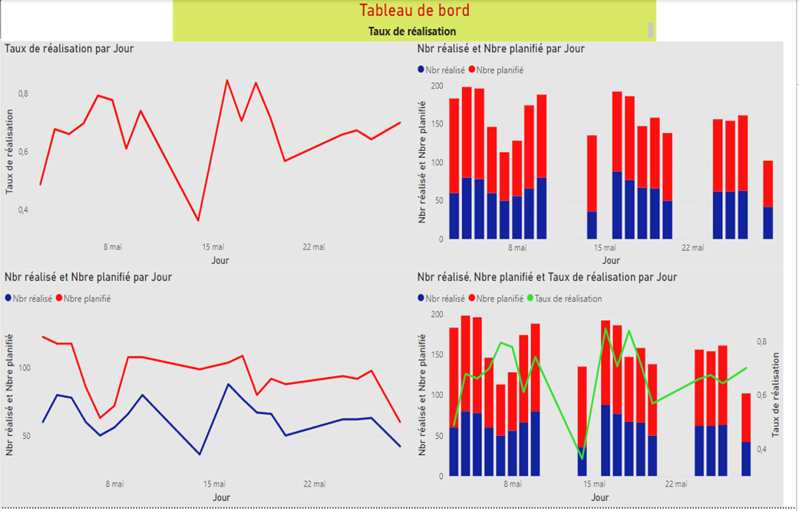

Figure 54 : Visualisation du taux de réalisation du mois de mai à destination de transfert

### Gains chiffrés

Grâce au nouveau plan de zonage proposé, le temps de cycle global semestriel est devenu 28 au lieu de 51, ce qui implique un gain semestriel de 23 jours et un gain annuel de 46 jours de déplacement vers le stock BS03.

Le gain en termes de performance est de 45%.

À l’aide des données concernant les couts logistiques et des gains en jours, j’ai pu chiffrer le gain annuel qui vaut : **220.800 MAD**

| Gain semestriel (en jours) | Gain annuel (en jours) | % des Gains |
|----------------------------|------------------------|-------------|
| 23                         | **46**                 | **45%**     |

Figure 55 : Calcule des gains semestriels et annuels

| Location des engins/jour (en MAD) | Consommation du carburant/mois (en MAD) | Salaire de l'opérateur/mois (en MAD) |
|-----------------------------------|-----------------------------------------|--------------------------------------|
| 4000                              | **20000**                               | **4000**                             |

Figure 56 : Les couts logistiques

| Location des engins de manutention | Carburant des engins de manutention | Salaire des opérateurs | Total (en MAD) |
|------------------------------------|-------------------------------------|------------------------|----------------|
| 184000                             | **30667**                           | **6133**               | **220800**     |

Figure 57 : Calcul du gain total en MAD

### Confirmation du plan d’action

Le plan d’action ainsi que la validation se trouvent respectivement en annexes 3 et 4.

**Conclusion**

La démarche d’amélioration continue permet à une entreprise de rester compétitive. En effet, cette méthodologie permet d’atteindre les objectifs fixés tout en maintenant le niveau de qualité demandé afin d’obtenir une réelle satisfaction de la part du client.

Au-delà des gains engendrés, les projets Lean Six Sigma apportent une discipline nécessaire à la gestion de projet en équipe. En particulier, cette méthodologie permet en finalité de renforcer la confiance du client tout en gardant une meilleure réputation de l’entreprise.

Dans le cas pratique, le projet étudié a permis de finaliser chaque étape de la démarche DMAIC de manière rationnelle et méthodique, grâce à l’emploi des outils appropriés. Par ailleurs, la correction des causes de dysfonctionnement mises en évidence permet d’optimiser la gestion du stock. L’étude effectuée dans le cadre de ce projet démontre également la nécessité de travailler en équipe pluridisciplinaire en unissant opérateurs, techniciens et responsables.

Enfin, ce projet représente un pas en avant dans la gestion des stocks du site de l’entreprise. Cependant le projet nécessite un très haut degré d’engagement et de discipline de la part de toutes les parties prenantes. En veillant sa pérennisation et poursuivre l’approche de l’amélioration continue.

Une intégration des stocks de brames et de tôle forte dans ce contexte est aussi sollicitée pour augmenter la performance globale de tous les stocks du site.
